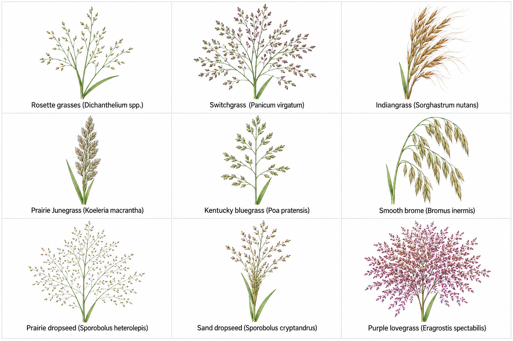
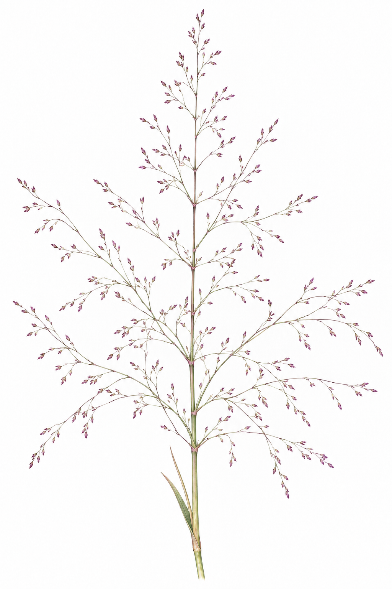
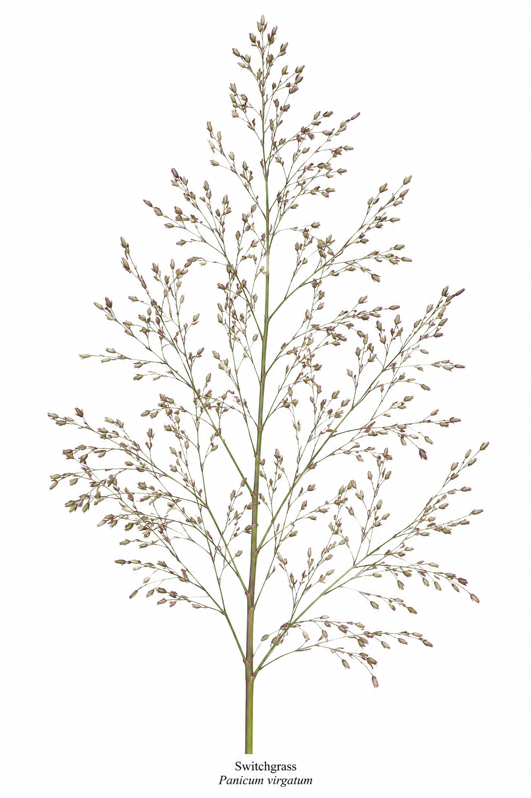
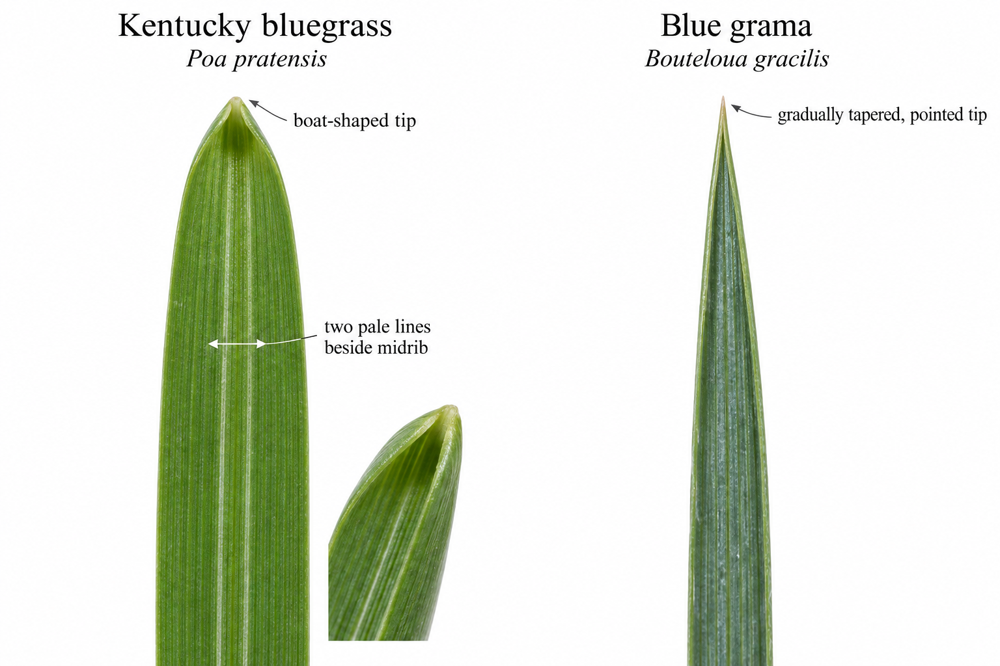

## *Equisetum* - Horsetails

::: list-table
- 

  - Species
  - Overall appearance
  - Stem and central cavity
  - Sheaths at nodes
  - Typical habitat

- 

  - *Equisetum arvense*
  - Bushy, with numerous regular whorls of ascending branches
  - Slender; central cavity relatively small, usually about ¼–⅓ of the stem diameter
  - Small sheaths with narrow, dark teeth; teeth usually remain visible
  - Roadsides, fields, disturbed soil, moist uplands, and wetland margins

- 

  - *Equisetum fluviatile*
  - Soft, upright stems; unbranched or bearing whorls of slender branches
  - Stem easily compressed; enormous central cavity, usually about ¾–⁹⁄₁₀ of the stem diameter
  - Green when young, often becoming gray with age; numerous narrow, dark teeth usually persist; a narrow black band may develop at the sheath base
  - Standing shallow water, marshes, pond margins, and wet ditches

- 

  - *Equisetum hyemale*
  - Coarse, stiff, mostly unbranched scouring rush; often forms dense colonies
  - Thick, strongly ridged, and distinctly rough from silica; large central cavity
  - Broad pale-gray or whitish sheath, usually bordered by a narrow black band at the base and often another at the top; teeth commonly shed, leaving a dark terminal rim
  - Moist woods, riverbanks, shores, and ditches, generally on firmer ground than *E. fluviatile*

- 

  - *Equisetum laevigatum*
  - Slender, mostly unbranched smooth scouring rush
  - Fewer, broader ridges; stem smooth or only slightly rough; central cavity about ½–¾ of the stem diameter
  - Sheath usually green and continuous in color with the internode, with one thin black band at the top; teeth generally shed by late summer
  - Moist sandy or gravelly soil, shores, roadsides, and open disturbed ground
:::

### ID Tips

- **Branching:** Dense, regular whorls producing a bushy or bottlebrush appearance strongly indicate *E. arvense*. However, *E. fluviatile* may also have whorled branches.

<!-- -->

- **Stem cross-section:** This is the strongest confirmation for *E. fluviatile*. Cut across an internode; the central cavity occupies most of the stem diameter.

- **Stem texture:** Rub the middle of an internode upward between two fingers. *E. hyemale* is distinctly rough and abrasive, whereas *E. laevigatum* is smooth or only weakly rough.

- **Sheath banding:** A broad pale-gray or whitish sheath bordered by narrow black bands at the bottom, top, or both strongly favors *E. hyemale*. A mostly green sheath with only a thin black terminal ring favors *E. laevigatum*.

- **Sheath teeth:** *E. fluviatile* usually retains numerous narrow, dark teeth. The sheath teeth of *E. hyemale* and *E. laevigatum* commonly fall off before September, leaving a dark rim.

- **Seasonal condition:** The separate pale fertile stems of *E. arvense* have normally disappeared by September. Identify it from its green, branched sterile stems. Cones may be absent or old on the other species.

- **Habitat:** Plants emerging directly from shallow water strongly favor *E. fluviatile*. Habitat is supporting evidence, but it should not replace examination of the stem and sheaths.

- **Possible hybrids:** Plants combining contradictory or intermediate characteristics may be hybrids. *E. arvense* × *E. fluviatile* produces *E. ×litorale*, while *E. hyemale* × *E. laevigatum* produces *E. ×ferrissii*. Photograph the sheaths and branching pattern and examine a stem cross-section rather than forcing such plants into one species.

## *Dalea* - Prairie Clovers

::: list-table
- 

  - Species
  - Leaves
  - Spent flower head
  - Other useful characteristics

- 

  - White prairie clover (*Dalea candida*)
  - Pinnately compound, usually with 5–9 oval to oblong leaflets. The leaflets are broader than those of purple prairie clover.
  - Dense, cylindrical, and somewhat thicker than that of purple prairie clover; usually pale brown or gray after flowering.
  - Stems are green, smooth, and relatively stout. The plant generally appears more robust and leafy.

- 

  - Purple prairie clover (*Dalea purpurea*)
  - Pinnately compound, usually with 3–7 very narrow, linear leaflets that may appear almost needle-like.
  - Dense, slender, and cylindrical; usually dark brown after flowering, with a narrow, pointed, conelike appearance.
  - Stems are slender and wiry and may be reddish or purplish. The plant generally has a finer, more delicate appearance.
:::

### Similar species

- **Upright prairie coneflower (*Ratibida columnifera*):** Its elongated, dark-brown seed head can resemble the spent cylindrical head of a prairie clover. The coneflower head is a hard, prominent central cone on a long, mostly leafless stalk and may retain drooping yellow or reddish ray florets. Its leaves are simple but deeply divided into narrow lobes, whereas prairie clovers have pinnately compound leaves with distinct leaflets.

<!-- -->

- **Leadplant (*Amorpha canescens*):** Also has pinnately compound leaves and persistent flower spikes. Leadplant has many more leaflets, gray and densely hairy foliage, branching flower spikes, and somewhat woody stems.

- **Wild licorice (*Glycyrrhiza lepidota*):** Has pinnately compound leaves, but its leaflets are much larger and broader. Its fruits form conspicuous clusters of short, hooked or bristly pods rather than narrow terminal cones.

- **White sweetclover (*Melilotus albus*):** Has exactly three toothed leaflets per leaf. Its spent inflorescence is a long, loose raceme with individually visible pods rather than a compact cylindrical cone.

- **Alfalfa (*Medicago sativa*):** Also has exactly three toothed leaflets. Its spent flower clusters are short and rounded, often with tightly coiled pods, rather than long cylindrical cones.

- **Blazing stars (*Liatris* species):** May retain slender brown terminal spikes, but their leaves are simple and undivided rather than compound.

## *Rosa* - Wild roses

::: list-table
- 

  - Species
  - Growth form
  - Leaves
  - Prickles
  - Rose hips in September

- 

  - Prairie rose (*Rosa arkansana*)
  - Low, usually less than 60 cm tall; often forms patches of short stems arising from underground rhizomes
  - Pinnately compound, usually with 7–11 relatively small leaflets; leaflets are coarsely toothed
  - Stems usually have numerous slender, straight prickles of unequal sizes
  - Smooth, rounded to somewhat flattened, and red to reddish-orange; persistent sepals may remain at the tip

- 

  - Smooth rose (*Rosa blanda*)
  - Taller, commonly 60–150 cm or more; forms an upright, branching shrub
  - Pinnately compound, usually with 5–7 larger leaflets; leaflets are toothed and often paler beneath
  - Upper stems are usually unarmed or nearly so; paired prickles may occur near the bases of leaves, especially on lower stems
  - Smooth, red, and rounded to somewhat elongated; generally borne on the taller, branching stems
:::

### Similar species

- **Red raspberry (*Rubus idaeus*):** Has compound leaves with 3–5 leaflets, with the terminal leaflet much larger than the lateral leaflets. Leaflet undersides are conspicuously whitish. The stems are long canes with numerous fine bristles or prickles. Any remaining fruit is an aggregate of many fleshy drupelets, not a smooth, hollow rose hip.

- **White meadowsweet (*Spiraea alba*):** Can form patches of upright woody stems similar to smooth rose, but its leaves are simple rather than compound. It produces clusters of small, dry brown follicles rather than red hips.

- **Leadplant (*Amorpha canescens*):** A low prairie shrub that may resemble prairie rose in growth form. Its leaves have many small, gray-hairy leaflets with smooth margins, and its persistent flower spikes contain numerous small pods rather than rose hips.

- **Wild licorice (*Glycyrrhiza lepidota*):** Has pinnately compound leaves, but with many broad, smooth-edged leaflets. Its fruits occur in dense clusters of short, hooked or bristly pods rather than as individual red hips.

## *Liatris* - Blazing stars

::: list-table
- 

  - Species
  - Overall form
  - Flower or seed-head arrangement
  - Bracts around each head
  - Leaves and other useful characteristics

- 

  - Rough blazing star (*Liatris aspera*)
  - Usually 30–120 cm tall, with a single upright stem
  - Large, rounded, button-like heads are distinctly separated along a relatively loose spike; heads are stalkless or nearly stalkless
  - Broad and rounded, with jagged edges that curl or fold inward
  - Leaves and stems feel rough from short, stiff hairs; usually found in dry prairie

- 

  - Northern Plains blazing star (*Liatris ligulistylis*)
  - Usually 30–100 cm tall, with a single upright stem that is often reddish
  - Large, rounded, button-like heads are widely separated and usually borne on conspicuous stalks
  - Broad and spoon-shaped with rounded tips, jagged translucent margins, and often some purple coloration
  - Lower leaves are relatively broad, while upper leaves become abruptly small and bract-like; generally found in average to somewhat moist prairie

- 

  - Dotted blazing star (*Liatris punctata*)
  - Usually 30–60 cm tall; commonly has several short stems arising together
  - Small heads are tightly packed into a relatively short, narrow spike
  - Broad at the base and sharply pointed; pressed against the head or only slightly spreading, with long white hairs along the margins
  - Leaves are very narrow, stiff, upward-pointing, and marked with tiny resin dots; characteristic of dry, sandy prairie

- 

  - Prairie blazing star (*Liatris pycnostachya*)
  - Usually 60–150 cm tall; generally the tallest and most robust of these species
  - Numerous small heads are densely packed into a thick, continuous spike that may be 30 cm long
  - Narrow and sharply pointed, with pinkish or reddish tips that curve distinctly outward or backward
  - Leaves are very narrow and densely crowded along the stem; generally associated with mesic or moist prairie
:::

### Similar purple-flowered species

- **Purple prairie clover (*Dalea purpurea*):** Has a dense purple cylindrical head, but the leaves are pinnately compound with 3–7 narrow leaflets. Its spent inflorescence forms a relatively smooth, narrow cone rather than a spike composed of individually recognizable heads.

- **Leadplant (*Amorpha canescens*):** Has narrow purple flower spikes, but it is a branching, somewhat woody shrub. Its foliage is gray-hairy, and each leaf is divided into many small leaflets.

- **Hoary vervain (*Verbena stricta*):** Has several narrow purple spikes on a branching stem. Its leaves are large, simple, opposite, coarsely toothed, and densely hairy.

- **Anise hyssop (*Agastache foeniculum*):** Has dense purple terminal spikes, but its leaves are broad, simple, opposite, and toothed. The stem is square, and crushed foliage has a strong anise or licorice odor.

- **Thistles (*Cirsium* and *Carduus* species):** Have purple composite flower heads, but the leaves and involucral bracts are conspicuously spiny. Their heads do not form the narrow, orderly spikes characteristic of blazing stars.

## *Artemisia* - Sageworts and wormwoods

::: list-table
- 

  - Species
  - Growth form
  - Leaves
  - Flower clusters in September
  - Other useful characteristics

- 

  - Tarragon (*Artemisia dracunculus*)
  - Upright and usually 60–120 cm tall; stems branch primarily in the upper portion
  - Long, very narrow, simple, and mostly undivided; green rather than silvery
  - Numerous tiny, rounded, greenish-yellow heads hang from short stalks in loose, leafy, spreading panicles
  - Usually aromatic when crushed; resembles a tall plant covered with narrow, willow-like leaves

- 

  - Field sagewort (*Artemisia campestris*)
  - Upright, often 60–150 cm tall; usually has a reddish or purplish stem and a narrow, erect crown
  - Lower leaves are deeply divided into narrow linear segments; upper leaves become smaller and less divided
  - Numerous tiny, rounded heads are held in narrow, upright, densely branched clusters
  - Usually has little or no scent; its inflorescence is narrower and more erect than that of tarragon

- 

  - White sage (*Artemisia ludoviciana*)
  - Upright, usually 30–90 cm tall; commonly forms dense colonies from rhizomes
  - Narrowly lance-shaped; mostly entire or shallowly lobed; densely covered with pale hairs and conspicuously white or silver
  - Tiny yellowish or brownish heads form a narrow, leafy panicle near the top of the stem
  - The uniformly whitish foliage and tendency to form patches are especially distinctive

- 

  - Absinthium (*Artemisia absinthium*)
  - Robust, bushy, and usually 60–120 cm tall; often branches extensively
  - Broad, deeply divided two or three times, and densely hairy; gray-green to silvery
  - Numerous relatively conspicuous, rounded, yellow, nodding heads occur in branching panicles
  - Strongly aromatic; nonnative; leaves have broader, more rounded divisions than those of prairie sagewort

- 

  - Prairie sagewort (*Artemisia frigida*)
  - Low and mound-forming, usually only 10–40 cm tall; numerous stems arise from a woody base
  - Finely divided two or three times into very narrow segments; densely silky and silver-gray
  - Tiny, nodding, yellowish heads are borne in short, branching clusters above the foliage
  - Much shorter and more compact than the other species; characteristic of dry prairie
:::

### Similar species

- **Horseweed (*Erigeron canadensis*):** Can resemble tarragon because it is tall, narrow-leaved, and covered with many tiny heads in September. Horseweed has a dense, plume-like terminal panicle, and its narrow leaves are often finely toothed and hairy. Its flower heads are upright and cylindrical, with tiny white ray flowers, rather than rounded and nodding as in tarragon.

- **Common ragweed (*Ambrosia artemisiifolia*):** Has deeply divided leaves resembling some *Artemisia* species. Ragweed is green rather than silvery, lacks the characteristic sage odor, and has slender spikes of small green male flower heads above clusters of female flowers.

- **Western ragweed (*Ambrosia psilostachya*):** Forms colonies like white sage, but its leaves are green, usually deeply lobed, and rough rather than uniformly white and woolly. Its flower heads form narrow, erect spikes.

- **Common yarrow (*Achillea millefolium*):** Has finely divided, aromatic leaves that may resemble prairie sagewort. Its flower heads form a broad, flat-topped cluster and usually retain white flower parts or pale, flattened remnants.

- **Tansy (*Tanacetum vulgare*):** Has deeply divided, aromatic leaves, but the leaf segments are broader and sharply toothed. Its flower heads are relatively large, bright-yellow, button-like, and arranged in a broad, flat-topped cluster.

## Yellow composite flowers

::: list-table
- 

  - Species
  - Growth form
  - Leaves
  - Flower head
  - Most useful identification characteristics

- 

  - Black-eyed Susan (*Rudbeckia hirta*)
  - Usually 30–90 cm tall, with one or several mostly unbranched flowering stems
  - Simple, alternate, lance-shaped to oblong, and densely covered with stiff hairs; lower leaves may be broader
  - Large head with yellow rays surrounding a dark-brown, strongly domed disk
  - The entire plant is conspicuously rough and hairy. Heads are usually solitary at the ends of long stalks, and the central disk is rounded rather than elongated.

- 

  - Upright prairie coneflower (*Ratibida columnifera*)
  - Usually 30–90 cm tall, with slender, branching stems
  - Simple but deeply divided into narrow linear lobes
  - Yellow or reddish-brown rays droop from the base of a tall, narrow, cylindrical disk
  - The elongated central cone is distinctive and persists as a hard, dark-brown seed head after the rays fall.

- 

  - Maximilian sunflower (*Helianthus maximiliani*)
  - Tall, commonly 90–250 cm; usually has a strong, upright stem with several heads near the top
  - Alternate, long, narrow, lance-shaped, folded or curved along the midrib, and rough; usually crowded along the stem
  - Yellow rays surround a yellowish-brown to dark disk; several relatively large heads occur on the upper stem
  - Recognized by its tall stature and numerous long, narrow, drooping or folded leaves extending nearly to the flower cluster.

- 

  - Stiff sunflower (*Helianthus pauciflorus*)
  - Usually 60–180 cm tall, with a stiff, mostly unbranched stem and relatively few heads
  - Mostly opposite, thick, stiff, rough, blue-green, and nearly stalkless; usually with three conspicuous main veins
  - Large head with yellow rays surrounding a dark reddish-brown or purplish disk
  - The opposite, rigid, nearly stalkless leaves are the best field characteristic. The plant often bears only one to a few large heads.

- 

  - Prairie sunflower (*Helianthus petiolaris*)
  - Usually 30–120 cm tall; an annual with an openly branching form
  - Mostly alternate, rough, lance-shaped to ovate, and borne on conspicuous leaf stalks
  - Yellow rays surround a dark-brown disk; heads are borne singly at the ends of slender branches
  - The branched annual growth form and distinctly stalked leaves separate it from the taller perennial sunflowers. It is most common in dry, sandy, or disturbed ground.

- 

  - False sunflower (*Heliopsis helianthoides*)
  - Usually 60–150 cm tall, with branching stems and several flower heads
  - Opposite, ovate to lance-shaped, coarsely toothed, and borne on short stalks
  - Yellow rays surround a yellow to orange-yellow disk rather than a dark-brown disk
  - Opposite, broad, toothed leaves and a yellow central disk are the easiest field marks. The rays can produce seeds and often remain attached longer than those of true sunflowers.

- 

  - Hairy false goldenaster (*Heterotheca villosa*)
  - Low to medium height, usually 15–60 cm; often bushy and branched from near the base
  - Alternate, narrow to oblong, gray-green, and densely hairy
  - Numerous relatively small heads with both yellow rays and a yellow disk
  - The plant is densely hairy throughout and usually bears many smaller heads. It lacks the large, dark central disk characteristic of *Rudbeckia*, *Ratibida*, and most *Helianthus* species.
:::

## *Solidago* - Goldenrods

::: list-table
- 

  - Species
  - Flower-cluster shape
  - Stem
  - Leaves
  - Habitat and best identification characteristics

- 

  - **Giant goldenrod (*Solidago gigantea*)**
  - Broad, pyramidal cluster with arching or spreading branches; most heads are carried along the upper sides of the branches
  - Smooth and hairless below the flower cluster; often covered with a pale, waxy bloom
  - Alternate, lance-shaped, sharply toothed, and usually three-veined; mostly hairless except along the veins beneath
  - Common in moist soil, ditches, wet prairie, and woodland edges. The smooth, often waxy stem is the best distinction from tall and Canada goldenrods.

- 

  - **Tall goldenrod (*Solidago altissima*)**
  - Large, pyramidal or plume-shaped cluster with arching branches
  - Densely covered with short hairs for most or all of its length
  - Alternate, lance-shaped, sharply toothed, prominently three-veined, and usually rough on the upper surface; lower surfaces are hairy
  - Common in dry to mesic fields, roadsides, and disturbed areas. Often forms dense colonies. The consistently hairy stem and rough leaves are important field marks.

- 

  - **Canada goldenrod (*Solidago canadensis*)**
  - Broad, pyramidal or plume-shaped cluster with arching branches
  - Usually smooth or sparsely hairy below, becoming hairy on the upper stem and within the flower cluster
  - Alternate, narrow and lance-shaped, sharply toothed, and prominently three-veined; lower surfaces are hairy, especially along the veins
  - Common in fields, roadsides, and disturbed ground. Very similar to tall goldenrod; stem hairiness and leaf texture must be examined closely, and some plants may be difficult to distinguish confidently in the field.

- 

  - **Missouri goldenrod (*Solidago missouriensis*)**
  - Narrow to broadly pyramidal cluster, often somewhat one-sided, with spreading or recurved branches
  - Smooth, hairless, and frequently reddish
  - Alternate, narrow, stiff, and mostly smooth; margins are entire or have only a few small teeth; lower leaves are longer and may remain present during flowering
  - Found in dry prairie and sandy or gravelly soil. Usually shorter and less leafy than the plume-forming goldenrods, with smooth stems and mostly untoothed leaves.

- 

  - **Stiff goldenrod (*Solidago rigida*)**
  - Dense, broad, flat-topped or gently rounded cluster
  - Stout, upright, and densely hairy
  - Alternate, broad, thick, stiff, rough, and mostly untoothed; upper leaves are nearly stalkless and may partly clasp the stem
  - Found in dry to mesic prairie. The flat-topped flower cluster and broad, rigid leaves make it readily distinguishable from the other species in this guide.

- 

  - **Stiff-leaved showy goldenrod (*Solidago rigidiuscula*)**
  - Dense, narrow, erect, cylindrical or club-shaped cluster; branches point upward rather than arching outward
  - Stout, upright, and usually smooth or only sparsely hairy
  - Alternate, firm, and lance-shaped to narrowly elliptic; lower leaves are larger and stalked, while upper leaves become smaller and nearly stalkless
  - Found in dry prairie. The showy, upright flower cluster distinguishes it from the flat-topped stiff goldenrod and the arching, plume-shaped goldenrods. This taxon is also treated as *Solidago speciosa* var. *rigidiuscula*.
:::

- **Early goldenrod (*Solidago juncea*)** is present at the Regional Science Center, but it normally flowers earlier in the summer and is generally no longer flowering in September.

<!-- -->

- **Canada goldenrod versus tall goldenrod:** These are the most difficult pair in the guide. Tall goldenrod generally has short hairs covering most or all of the main stem, and its leaves are distinctly rough above and hairy beneath. Canada goldenrod is usually smooth or only sparsely hairy on the lower stem, becoming hairy toward the flower cluster; its leaves are typically narrower and less rough. Variable or intermediate plants may not be identifiable confidently without close examination.

- **Missouri goldenrod versus Canada goldenrod:** Missouri goldenrod usually has a smooth, often reddish stem and narrow, firm leaves that are mostly untoothed and smooth. Canada goldenrod generally has a hairy upper stem and thinner leaves with numerous sharp teeth and hairs beneath. Missouri goldenrod also tends to be shorter and less densely leafy, with a narrower flower cluster, while Canada goldenrod commonly forms tall, dense colonies with broad, plume-shaped clusters.

- **Giant goldenrod versus tall goldenrod:** Check the main stem below the flower cluster. Giant goldenrod has a smooth, hairless stem that often has a whitish, waxy coating, whereas tall goldenrod has a noticeably hairy stem. Giant goldenrod leaves are relatively smooth except for hairs along the veins beneath; tall goldenrod leaves are rough above and more generally hairy beneath.

- **Missouri goldenrod versus giant goldenrod:** Both can have smooth, hairless stems. Missouri goldenrod is usually shorter and grows in dry prairie, with narrow, firm leaves that have few or no teeth. Giant goldenrod is usually taller and grows in wetter ground, with broader, sharply toothed leaves and a stem that often has a pale, waxy coating.

- **Stiff goldenrod versus stiff-leaved showy goldenrod:** Despite their similar common names, their flower clusters differ substantially. Stiff goldenrod has a broad, flat-topped or gently rounded cluster and broad, rigid leaves. Stiff-leaved showy goldenrod has a narrow, upright, cylindrical or club-shaped cluster and narrower leaves.

## Grasses with panicle-type inflorescences

::: list-table
- 

  - Species
  - Panicle
  - Leaves and growth form
  - Most useful identification characteristics

- 

  - Rosette grasses (*Dichanthelium* species)
  - Small, delicate, and usually open, with fine branches bearing tiny oval spikelets
  - Generally short grasses with relatively broad leaves; many species produce a low cluster of shortened leaves later in the season
  - Much smaller and more delicate than the other panicled grasses. Identification to species usually requires examination of hairs, ligules, leaf proportions, and spikelets.

- 

  - Switchgrass (*Panicum virgatum*)
  - Large, open, and airy, often 20–50 cm long; fine branches bear small oval spikelets that may be green, reddish, or purple
  - Tall, robust, warm-season grass growing in large clumps or loose colonies; leaves are broad with a prominent pale midrib
  - Distinguished by its large, diffuse panicle, robust stature, prominent leaf midrib, and dense patch of hairs where the leaf blade meets the sheath.

- 

  - Indiangrass (*Sorghastrum nutans*)
  - Narrow and plume-like, becoming golden-brown or bronze; spikelets have long, bent or twisted awns
  - Tall, upright, warm-season bunchgrass with long, flat leaves
  - Look for the golden-bronze plume, bent awns, and a prominent notched ligule that resembles the rear sight of a rifle.

- 

  - Prairie Junegrass (*Koeleria macrantha*)
  - Narrow, dense, and spike-like; usually pale green early and tan or silvery by September
  - Short, tufted cool-season grass with narrow leaves; stems and sheaths may be softly hairy
  - Smaller than the other species and recognized by its narrow, compact, silvery-tan panicle. The panicle may loosen slightly at flowering but contracts again afterward.

- 

  - Kentucky bluegrass (*Poa pratensis*)
  - Open and pyramidal, with slender branches arranged in tiers; branches commonly spread in groups around the main axis
  - Short, sod-forming grass with relatively soft, narrow leaves
  - Leaf tips are distinctly boat-shaped. Leaves often show two pale lines along the midrib when held toward the light. The plant forms a dense turf rather than a discrete bunch.

- 

  - Smooth brome (*Bromus inermis*)
  - Open to somewhat contracted, with spreading or drooping branches bearing relatively large, flattened spikelets
  - Tall, strongly rhizomatous grass that forms dense colonies; leaves are broad and flat
  - The large, elongated, many-flowered spikelets separate it from the grasses with tiny spikelets. Leaves often have a faint W- or M-shaped crease across the blade.

- 

  - Prairie dropseed (*Sporobolus heterolepis*)
  - Open, airy, and broadly pyramidal, with extremely fine branches and tiny spikelets
  - Dense bunchgrass forming a fountain of very narrow, wiry, arching leaves
  - Distinguished by its dense basal tuft, fine hair-like leaves, and delicate panicle held above the foliage. Flowering plants may have a coriander- or popcorn-like odor.

- 

  - Sand dropseed (*Sporobolus cryptandrus*)
  - Narrow and partly enclosed by the upper leaf sheath when young, becoming open and pyramidal as it matures
  - Loosely tufted or sometimes nearly solitary; leaves are narrow and often rolled or folded
  - Look for conspicuous tufts of long white hairs at the junction of the leaf blade and sheath. It is most common in dry, sandy, or disturbed soil.

- 

  - Purple lovegrass (*Eragrostis spectabilis*)
  - Large, very open, and diffusely branched; reddish-purple when flowering and tan at maturity
  - Low, tufted grass with flat to slightly rolled leaves; the panicle may comprise much of the plant's visible height
  - The cloud-like purple panicle is distinctive. At maturity, the entire brittle panicle may detach and tumble in the wind.
:::

::: {#fig-grass-panicles layout-ncol="2"}
{#fig-purple-lovegrass}

{#fig-switchgrass}

Comparison of the open panicles of purple lovegrass and switchgrass.
:::

