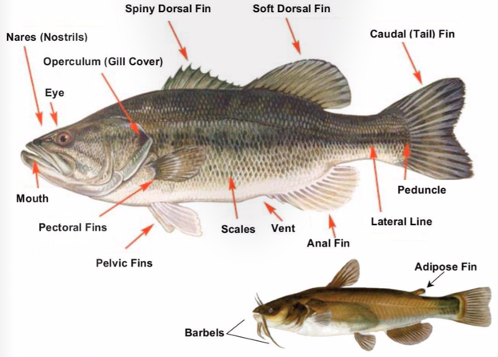

## Learning Objectives

By the end of this lab, you will be able to:

1.  Explain how fish diversity reflects stream health, habitat structure, and ecological niches.

2.  Demonstrate proper seining techniques in a shallow stream.

3.  Identify fish species using regional field guides and iNaturalist.

4.  Record ecological data systematically in a field notebook.

5.  Describe how land use and water quality influence fish communities in Minnesota streams.

6.  Connect your field observations to broader ecological patterns of biodiversity, disturbance, and ecosystem services.

## Preparation for the Lab (what to bring)

- Field notebook and pencil (required)

- Printed lab handout (or copy the fish diagram and species list into your field notebook)

- Water bottle

- Sun protection (hat, sunscreen, sunglasses)

- Insect repellent

- Weather-appropriate clothing (layers, rain gear if needed)

- Sandals or shoes that can get wet. Flip flops will not work, they will get pulled off your feet by the current. There will be some calf-high rubber boots and some chest waders available. Please come early if you want these, so you can try them on to find a size that fits.

- Camera or smartphone for iNaturalist

## Equipment Provided (by instructor)

- Seine nets (10–20 ft)

- Fish identification guides

- Buckets and aquaria for holding fish temporarily

- Aquaria for viewing fish

- Field notebook and pencil

## Background Information

### Stream Ecology in Minnesota

Streams and rivers are dynamic ecosystems that transport water, nutrients, and organisms across the landscape. In Minnesota, rivers such as the Buffalo River support fish communities that reflect both natural processes (flow, substrate, temperature) and human impacts (land use, pollution, habitat alteration). Monitoring fish diversity provides a direct way to assess stream health.

### Key Ecological Concepts

- **Biodiversity & Indicators:** Different fish species occupy ecological niches that can reveal water quality and habitat condition. Sensitive species like darters often indicate clean, oxygen-rich water, while tolerant species such as bullheads persist in more degraded habitats.

- **Adaptations:** Fish morphology (body shape, fin placement, mouth structure) reflects ecological roles and flow environments. Streamlined fish thrive in fast water, while bottom feeders have downturned mouths adapted for grazing.

- **Ecosystem Services:** Healthy streams provide ecosystem services including water filtration, nutrient cycling, recreation, and fisheries. Human activity that changes stream flow or water quality alters these services.

### Connection to Lecture Content

This lab links directly to lecture topics on biodiversity, species interactions, and community ecology. Your field observations will reinforce how ecological theory applies to local Minnesota ecosystems.

## Field Methods: Seining in Shallow Streams

### Site Selection

- Choose any shallow section of the river, or slow- to moderate-flow sections up to knee deep. Anything deeper than that and the fish will easily see the seine and outswim you.

- Gravel or sand substrates work the best

- Check that water depth is safe for wading. Avoid areas with strong current or unstable footing. Watch out for rocks or branches the seine could catch on.

### Team Roles

- **Seiners (2 people):** Hold the ends of the seine.

- **Assistants (1–2 people):** Disturb the substrate upstream or guide fish toward the net. Pick up middle of the net and hold it closed, if necessary.

- **Recorder:** Notes conditions, species, and counts in the field notebook.

### Seining Technique

1.  Position the seine net perpendicular to stream flow, one person near shore and one farther out. Keep the poles tilted towards downstream.

2.  Walk slowly, dragging the weighted edge along the streambed, while keeping the float line above water.

3.  After a short distance, quickly lift the seine, keeping the bottom edge tight to trap fish.

4.  Alternative method: start in the middle of the river and seine towards the bank, trapping fish between the seine and the bank. The downstream seiner should reach the bank first (fish default to escape downstream). When you reach the bank, pull the bottom line tight and scoop up. This works especially well if there is overhanging vegetation for the fish to hide in (be sure to scoop up through the vegetation).

5.  Alternative method for very shallow, narrow stream where net can stretch across: place the seine tilted very far back so most of the net is laying on the stream bed. Have one or more people approach the seine from upstream, shuffling their feet to disturb the rocks or vegetation. When they get close to the seine, quickly pull the seine taught from either direction, lifting the net out of the water.

### Handling Fish

- Quickly carry seine to a bare beach or sandbar and lay it out flat.

- Transfer captured fish into a bucket of stream water.

- Minimize handling and stress; use wet hands if touching fish.

### Sorting, Identifying, and Recording

- Separate fish by species using the field guide.

- Count individuals of each species.

- Record species names, counts, and site information in your field notebook.

### Photographing for iNaturalist

- Photograph at least one clear individual per species, showing diagnostic features. (At least one person per group).

- Upload to iNaturalist, tagging location and date.

### Releasing Fish

- After identification and photographing, gently return all fish to the stream.

## Field Notebook Entry Requirements

Your notebook is your scientific record. Each entry should demonstrate clear observation, accurate data recording, and thoughtful reflection.

### Required Elements

- **Metadata:** Date, start/end times, location (GPS if possible), weather, names of team members.

- **Species List & Counts:** Record both common and scientific names, with the number of individuals observed.

- **Map of Sampling Area:** Draw a labeled sketch of the section of the Buffalo River where you sampled. Note depth, flow, substrate, and landmarks.

- **Observations:** Record notes on fish behavior, habitat conditions, and any unexpected events.

- **Photographic Records:** Indicate which species were photographed for iNaturalist.

### Reflection prompts (include at least 2–3 sentences)

- How do the species we found reflect stream health and ecological niches?

- What patterns did you notice in habitat use (e.g., fast vs. slow water, sandy vs. rocky substrate)?

- How do today’s results connect to concepts from lecture (biodiversity, disturbance, species interactions)?

### Assessment

Notebook entries will be checked for:

- Completeness of metadata and species data.

- Clear, legible notes and maps.

- Evidence of reflection and connection to course concepts.

## Appendix A. Fish Identification and Species List

### Quick Guide to Fish Identification

When identifying fish in the field, focus on these traits:

- **Fins** – Note the number, size, and placement of dorsal, pectoral, pelvic, anal, and caudal fins. Shapes differ among species and reflect swimming style and habitat.

- **Mouth Position** – Bottom-facing mouths (suckers, catfish) indicate bottom-feeding habits. Forward-facing mouths (minnows, shiners, darters) suggest midwater or surface feeding.

- **Body Shape** – Streamlined bodies are typical in fast-flowing water; deeper or laterally compressed bodies are common in slower water.

- **Scales and Skin** – Smooth-skinned catfish lack scales; scale size and texture vary among other groups.

- **Coloration and Markings** – Stripes, bars, or distinctive tail coloration (e.g., redhorses) help separate species.

### Ecological Roles of Common Fish Groups

Fish species occupy different roles within stream ecosystems. Understanding these niches helps clarify how fish contribute to the overall health of the ecosystem:

- **Suckers (including Redhorses)**: Bottom-dwelling fish with downturned mouths that graze on algae, detritus, and benthic invertebrates. Redhorses, a type of sucker, are larger with deep bodies and a distinctive red or orange tail fin.

- **Catfishes**: Bottom-dwellers with barbels (whiskers) that sense prey. Bullheads are usually found in slow moving or turbid water, channel cats prefer faster moving water and often sit in the water column, while smaller stonecats are live in rocky streambeds, feeding on insects and small aquatic organisms.

- **Minnows and Shiners**: Small schooling fish that feed on insects, algae, and plant material. They are common in a variety of stream habitats.

- **Chubs**: Medium-sized, robust fish found in moderate currents. They can be predators or omnivores, feeding on invertebrates and small fish.

- **Daces**: Small, slender fish adapted to fast-moving waters. They feed on small invertebrates and are often found in clear, cool streams.

- **Darters**: Small, bottom-dwelling fish that dart between rocks and debris. They are often indicators of good water quality and thrive in fast currents.

## Species List

| Family | Common Name | Scientific Name |
|---------------------------------|-------------------|---------------------|
| Mooneyes – Hiodontidae | Goldeye | *Hiodon alosoides* |
|  | Mooneye | *Hiodon tergisus* |
| Catfishes – Ictaluridae | Stonecat | *Noturus flavus* |
|  | Tadpole madtom | *Noturus gyrinus* |
|  | Black Bullhead | *Ameiurus melas* |
|  | Yellow Bullhead | *Ameiurus natalis* |
|  | Brown Bullhead | *Ameiurus nebulosus* |
|  | Channel Catfish | *Ictalurus punctatus* |
| Minnows & Carps – Cyprinidae / Leuciscidae | Emerald shiner | *Notropis atherinoides* |
|  | River shiner | *Notropis blennius* |
|  | Bigmouth shiner | *Notropis dorsalis* |
|  | Blackchin shiner | *Notropis heterodon* |
|  | Blacknose shiner | *Notropis heterolepis* |
|  | Spottail shiner | *Notropis hudsonius* |
|  | Rosyface shiner | *Notropis rubellus* |
|  | Sand shiner | *Notropis stramineus* |
|  | Mimic shiner | *Notropis volucellus* |
|  | Common shiner | *Luxilus cornutus* |
|  | Bluntnose minnow | *Pimephales notatus* |
|  | Fathead minnow | *Pimephales promelas* |
|  | Blacknose dace | *Rhinichthys atratulus* |
|  | Longnose dace | *Rhinichthys cataractae* |
|  | Hornyhead chub | *Nocomis biguttatus* |
|  | Central stoneroller | *Campostoma anomalum* |
|  | Spotfin shiner | *Cyprinella spiloptera* |
|  | Silver chub | *Macrhybopsis storeriana* |
|  | Creek chub | *Semotilus atromaculatus* |
|  | Allegheny pearl dace | *Margariscus margarita* |
|  | Northern redbelly dace | *Chrosomus eos* |
|  | Finescale dace | *Chrosomus neogaeus* |
|  | Golden shiner | *Notemigonus crysoleucas* |
|  | European carp | *Cyprinus carpio* |
| Suckers – Catostomidae | Silver redhorse | *Moxostoma anisurum* |
|  | Golden redhorse | *Moxostoma erythrurum* |
|  | Shorthead redhorse | *Moxostoma macrolepidotum* |
|  | Greater redhorse | *Moxostoma valenciennesi* |
|  | White sucker | *Catostomus commersonii* |
|  | Quillback | *Carpiodes cyprinus* |
| Drums – Sciaenidae | Freshwater drum | *Aplodinotus grunniens* |
| Sunfishes & Basses – Centrarchidae | Largemouth bass | *Micropterus salmoides* |
|  | Smallmouth bass | *Micropterus dolomieu* |
|  | Green sunfish | *Lepomis cyanellus* |
|  | Pumpkinseed | *Lepomis gibbosus* |
|  | Orangespotted sunfish | *Lepomis humilis* |
|  | Bluegill | *Lepomis macrochirus* |
|  | Black crappie | *Pomoxis nigromaculatus* |
|  | Rock bass | *Ambloplites rupestris* |
| Darters & Perches – Percidae | Blackside darter | *Percina maculata* |
|  | River darter | *Percina shumardi* |
|  | Iowa darter | *Etheostoma exile* |
|  | Johnny darter | *Etheostoma nigrum* |
|  | Sauger | *Sander canadensis* |
|  | Walleye | *Sander vitreus* |
|  | Yellow perch | *Perca flavescens* |
| Sticklebacks – Gasterosteidae | Brook stickleback | *Culaea inconstans* |
| Killifishes – Fundulidae | Banded killifish | *Fundulus diaphanus* |
| Trout-perches – Percopsidae | Trout-perch | *Percopsis omiscomaycus* |
| Whitefishes – Salmonidae | Cisco | *Coregonus artedi* |
| Pikes – Esocidae | Northern pike | *Esox lucius* |
| Mudminnows – Umbridae | Central mudminnow | *Umbra limi* |
| Lampreys – Petromyzontidae | Chestnut lamprey | *Ichthyomyzon castaneus* |
|  | Silver lamprey | *Ichthyomyzon unicuspis* |

