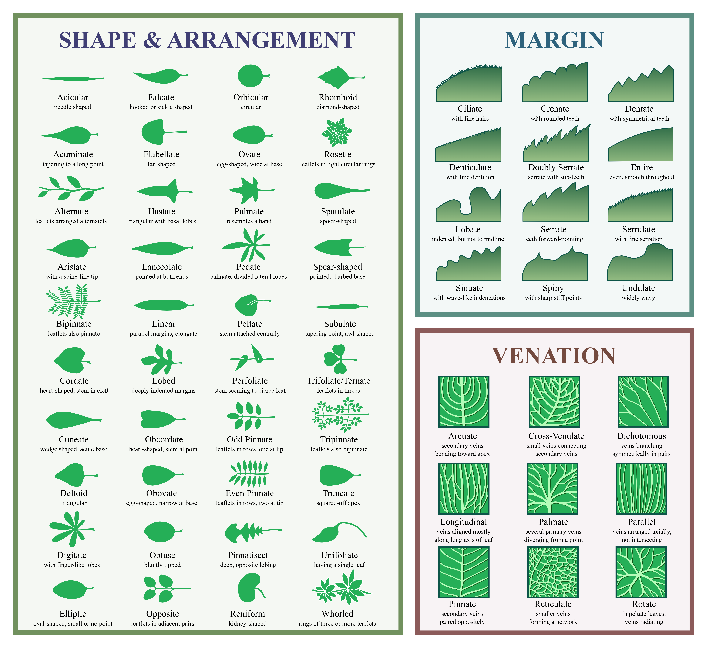

## Learning Outcomes

### Concepts

- Grassland vegetation types: grass, forb, woody, nonvascular, dead
- Abundance and distribution
- Grassland restoration
- Vegetation monitoring

### Skills

- Grassland plant identification
- Estimation of abundance and distribution
- Field data collection using datasheets
- Field data collection using ArcGIS Field Maps

## Introduction

The purpose of this two-part lab is to introduce you to the [Prairie Reconstruction Initiative (PRI) Vegetation Monitoring Protocol](https://sites.google.com/view/prairiereconinitiative/what-we-do/monitoring-protocol), a standardized protocol developed for monitoring prairie reconstructions. The PRI protocol combines two complementary methods: a **meandering walk** and **nested frequency plots**.

In Part 1, you will conduct a meandering walk. This botanist-directed survey is designed to develop as complete a plant species list as possible while also recording the general abundance and distribution of each species. In Part 2, you will use nested plots to quantify species frequency. Together, the two methods provide complementary information about the composition and condition of a prairie reconstruction.

### About the Prairie Reconstruction Initiative

The [Prairie Reconstruction Initiative (PRI)](https://sites.google.com/view/prairiereconinitiative/) is a collaboration among prairie reconstruction practitioners and researchers. PRI develops standardized approaches for documenting, monitoring, and learning from prairie reconstructions. Its vegetation monitoring protocol combines meandering walks and nested frequency plots so that practitioners can track vegetation changes through time and compare results among reconstructions.

## Your Assignment

You will complete **two meandering walks of approximately 45 minutes each** in the two areas identified by your instructor.

For each walk:

1.  Search the area for plant species using the PRI meandering-walk method.
2.  Record each species encountered on the provided datasheet.
3.  Estimate the abundance and distribution of each species.
4.  Record your walking route using ArcGIS Field Maps.

After lab, enter your data on the Google Sheet provided by your instructor.

::: callout-note
## Course implementation

We will follow the PRI meandering-walk method with several modifications for this lab. You will conduct two approximately 45-minute surveys in areas designated by your instructor, record your survey routes using ArcGIS Field Maps, and record vegetation observations on the provided datasheets. After lab, you will enter your observations into the class dataset.
:::

## Pre-Lab Instructions

- Create an MSUM ArcGIS account using the StarID method as described in the document posted to D2L.
- Install the ArcGIS Field Maps app on your device.

## Bring to Lab

- Field clothes suitable for walking through tall, damp grass and brush
- Field notebook
- A mobile device with ArcGIS Field Maps installed
- Pencil or pen
- (optional) Camera or other device for photographing plants
- (optional) iNaturalist app

## PRI Meandering Walk

The field methods used in this lab are based on the **Prairie Reconstruction Initiative (PRI) Vegetation Monitoring Protocol Framework**. PRI developed this standardized protocol to monitor vegetation in prairie reconstructions and evaluate changes through time. The complete PRI protocol includes both the meandering walk used in this lab and the nested frequency plot method we will use in the next lab.

The meandering walk is used to track the progress of a seed-mix area by attempting to record all species expressed in the planting in a given year and through time. The observer strives to develop as complete a plant species list as possible for a seed-mix area during each meandering walk. This list will be larger than would be possible using a plot- or transect-based method. In addition, quantification of exotic and/or invasive species can provide insights about threats through time.

### What the meandering walk measures

The protocol records:

- Species encountered (presence)
- General abundance (sparse, occasional, frequent, very common)
- General distribution (localized, widespread)
- Duration of the survey
- Area surveyed

### Survey timing

Meandering walks are typically conducted annually and timed using phenological cues. In some cases, two walks may be conducted each year to detect both cool-season and warm-season plants.

### Sampling units

Each discrete seed-mix area is treated as a sampling unit and searched separately.

Care should be used when monitoring near the boundary of adjacent seed mixes because there may be a region of overlap, or a gap in application, between seed mixes. If seed-mix areas are highly interspersed or were applied in complicated patterns that make monitoring them separately impractical, they may be monitored as a single sampling unit.

### Conducting the meandering walk

Within each search area, conduct a **botanist's walk** with the goal of developing as complete a species list as possible.

A meandering walk is **not a random walk**. Instead, deliberately search the different vegetation zones and environmental conditions that occur within the sampling area. This might include areas differing in soil moisture, topography, vegetation structure, or other characteristics that could support different plant species.

Follow cues from the landscape about where additional species might occur. Unlike a transect or other fixed sampling method, you are encouraged to alter your route to investigate areas that appear likely to contain species you have not yet encountered.

All species encountered, whether native or non-native, should be recorded.

The amount of time required for a meandering walk may vary among surveys and should therefore be recorded. Monitoring should generally cover the same area with approximately the same search intensity when comparisons are made through time.

During this lab, ArcGIS Field Maps will record your route so that we have a spatial record of the area you searched. The purpose of recording the route is to document survey effort, **not** to create a route that must be followed exactly during future surveys.

## Data to Record

### Site information

**Overall site:** Record the name of the overall site.

**Planting unit:** Record the name of the planting unit.

**Seed-mix area:** Record the name of the seed-mix area targeted by the meandering walk.

**Soil moisture type:** Record "dry," "mesic," or "wet," as appropriate. If more than one moisture category occurs within a seed-mix area, each should be searched and recorded separately.

**Date:** Record the date of the survey as yyyy-mm-dd.

**Observer(s):** Record the names of all observers.

**Start time:** Record the time at the start of observations using a 24-hour clock (e.g., 14:32 = 2:32 pm).

**End time:** Record the time at the end of observations using a 24-hour clock.

**Total time:** Record the total amount of time spent conducting the meandering walk.

**Area searched:** Record the approximate total area searched in acres.

### Species

Record each native and non-native species encountered using its current scientific name.

If you cannot identify a plant to species, photograph or collect a specimen for later identification when appropriate. Record the genus if you can determine it. Keep unknown plants coded consistently so that multiple observations of the same unknown plant are not accidentally treated as different species.

Very small seedlings that cannot be identified confidently can be recorded as "unknown forb seedling" or "unknown grass seedling."

### Abundance and distribution

Abundance and distribution describe **different characteristics** of a species:

- **Abundance** describes how many individuals you encounter.
- **Distribution** describes how broadly those individuals are dispersed across the search area.

Record both for every species encountered.

#### Abundance

Record the general abundance of each species as **sparse**, **occasional**, **frequent**, or **very common**.

| Abundance category | Definition |
|------------------------------------|------------------------------------|
| Sparse | Seldom occurring and usually occurring as an isolated plant; few total individuals observed |
| Occasional | Scattered plants in low numbers; sometimes occur in small clumps |
| Frequent | Many plants observed; species is regularly seen but rarely becomes dominant |
| Very Common | Species occurring in large numbers; can be dominant |

These categories are subjective, but applying them consistently provides useful information about vegetation change through time.

#### Distribution

Record the general distribution of each species as **localized** or **widespread**.

**Localized:** The species occurs in one or a few discrete locations within the area searched.

**Widespread:** The species is dispersed broadly throughout the area searched.

Abundance and distribution do not necessarily correspond. For example, a large, dense patch of reed canarygrass could be **frequent but localized**. Conversely, a species represented by only a few individuals could be **sparse but widespread** if those individuals occur in several widely separated parts of the search area.

### Comments

Record any relevant comments, including uncertainty about identification or unusual patterns of abundance or distribution.

## Species List

| Common name                     | Scientific name               |
|---------------------------------|-------------------------------|
| rough horsetail                 | *Equisetum hyemale*           |
| smooth horsetail                | *Equisetum laevigatum*        |
| Alfalfa                         | *Medicago sativa*             |
| White Sweetclover               | *Melilotus albus* \*          |
| Yellow Sweetclover              | *Melilotus officinalis* \*    |
| bird's-foot trefoil             | *Lotus corniculatus* \*       |
| Wild Licorice                   | *Glycyrrhiza lepidota*        |
| leadplant                       | *Amorpha canescens*           |
| white prairie clover            | *Dalea candida*               |
| purple prairie clover           | *Dalea purpurea*              |
| Tall Cinquefoil                 | *Drymocallis arguta*          |
| prairie smoke                   | *Geum triflorum*              |
| red raspberry                   | *Rubus idaeus*                |
| prairie rose                    | *Rosa arkansana*              |
| smooth rose                     | *Rosa blanda*                 |
| white meadowsweet               | *Spiraea alba*                |
| Siberian elm                    | *Ulmus pumila* \*             |
| showy milkweed                  | *Asclepias speciosa*          |
| common milkweed                 | *Asclepias syriaca*           |
| spreading dogbane               | *Apocynum androsaemifolium*   |
| hemp dogbane                    | *Apocynum cannabinum*         |
| Northern Bedstraw               | *Galium boreale*              |
| white campion                   | *Silene latifolia*            |
| procumbent pigweed              | *Amaranthus blitoides*        |
| Flodman's Thistle               | *Cirsium flodmanni*           |
| Broad-winged Thistle            | *Carduus acanthoides*         |
| common dandelion                | *Taraxacum officinale*        |
| Yellow Salsify                  | *Tragopogon dubius*           |
| rough blazing star              | *Liatris aspera*              |
| Rocky Mountain blazing star     | *Liatris ligulistylis*        |
| dotted gayfeather               | *Liatris punctata*            |
| prairie blazing star            | *Liatris pycnostachya*        |
| Tansy                           | *Tanacetum vulgare*           |
| Absinthe wormwood               | *Artemisia absinthium*        |
| Field Sagewort                  | *Artemisia campestris*        |
| Tarragon                        | *Artemisia dracunculus*       |
| fringed sagebrush               | *Artemisia frigida*           |
| Silver Wormwood                 | *Artemisia ludoviciana*       |
| common yarrow                   | *Achillea millefolium*        |
| giant goldenrod                 | *Solidago gigantea*           |
| tall goldenrod                  | *Solidago altissima*          |
| Canada goldenrod                | *Solidago canadensis*         |
| Missouri goldenrod              | *Solidago missouriensis*      |
| stiff-leaved goldenrod          | *Solidago rigida*             |
| showy goldenrod species complex | *Solidago speciosa*           |
| smooth blue aster               | *Symphyotrichum laeve*        |
| white heath aster               | *Symphyotrichum ericoides*    |
| Hairy False Goldenaster         | *Heterotheca villosa*         |
| Horseweed                       | *Erigeron canadensis*         |
| daisy fleabane                  | *Erigeron strigosus*          |
| Philadelphia fleabane           | *Erigeron philadelphicus*     |
| common ragweed                  | *Ambrosia artemisiifolia*     |
| western ragweed                 | *Ambrosia psilostachya*       |
| rough cocklebur                 | *Xanthium strumarium*         |
| black-eyed Susan                | *Rudbeckia hirta*             |
| upright prairie coneflower      | *Ratibida columnifera*        |
| Maximilian sunflower            | *Helianthus maximiliani*      |
| Stiff Sunflower                 | *Helianthus pauciflorus*      |
| Kalm's Lobelia                  | *Lobelia kalmii*              |
| Common Harebell                 | *Campanula rotundifolia*      |
| wild geranium                   | *Geranium maculatum*          |
| common evening-primrose         | *Oenothera biennis*           |
| great mullein                   | *Verbascum Thapsus* \*        |
| Painted-cup Paintbrush          | *Castilleja coccinea*         |
| anise hyssop                    | *Agastache foeniculum*        |
| common motherwort               | *Leonurus cardiaca*           |
| hoary vervain                   | *Verbena stricta*             |
| common toadflax                 | *Linaria vulgaris* \*         |
| greater plantain                | *Plantago major*              |
| large-flowered beardtongue      | *Penstemon grandiflorus*      |
| Allegheny monkeyflower          | *Mimulus ringens*             |
| Cylindrical Thimbleweed         | *Anemone cylindrica*          |
| field bindweed                  | *Convolvulus arvensis* \*     |
| hedge bindweed                  | *Calystegia sepium*           |
| Western Snowberry               | *Symphoricarpos occidentalis* |
| golden Alexanders               | *Zizia aurea*                 |
| Eastern Cottonwood              | *Populus deltoides*           |
| interior sandbar willow         | *Salix interior*              |
| hoary puccoon                   | *Lithospermum canescens*      |
| narrowleaf puccoon              | *Lithospermum incisum*        |
| upright yellow woodsorrel       | *Oxalis stricta*              |
| hoary alyssum                   | *Berteroa incana*             |
| riverbank grape                 | *Vitis riparia*               |
| switchgrass                     | *Panicum virgatum*            |
| little bluestem                 | *Schizachyrium scoparium*     |
| big bluestem                    | *Andropogon gerardi*          |
| Indiangrass                     | *Sorghastrum nutans*          |
| Prairie Junegrass               | *Koeleria macrantha*          |
| Rosette grasses                 | *Dicanthelium* spp.           |
| Smooth Meadow-grass             | *Poa pratensis* \*            |
| Smooth Brome                    | *Bromus inermis* \*           |
| Sand Dropseed                   | *Sporobolus cryptandrus*      |
| Purple Lovegrass                | *Eragrostis spectabilis*      |
| Sideoats Grama                  | *Bouteloua curtipendula*      |
| Blue Grama                      | *Bouteloua gracilis*          |
| wild asparagus                  | *Asparagus officinalis*       |
| Prairie Onion                   | *Allium stellatum*            |
| Wood Lily                       | *Lilium philadelphicum*       |
| common arrowgrass               | *Triglochin maritima*         |

\* = invasive, **bold** = common

## Plant Terminology

| Term | Definition |
|------------------------------------|------------------------------------|
| Annual | Plant species that complete their life cycle in one season, then die. |
| Biennial | Plant species that complete their life cycle in two seasons, then die. |
| Deciduous | Plants that shed their leaves seasonally, usually during the winter or dry season. The converse is evergreen. |
| Evergreen | Plants that keep their leaves year-round. The converse is deciduous. |
| Fern | A group of vascular plants that reproduce via spores and have neither seeds nor flowers. |
| Forb | Herbaceous flowering plants that are not graminoid. |
| Graminoid | Herbaceous plants with grass-like morphology, including grasses (Poaceae), sedges (Cyperaceae), and rushes (Juncaceae). |
| Grassland | An area where the vegetation is dominated by grasses (Poaceae). |
| Herbaceous | Vascular plants that have no persistent woody stems above ground. Includes many perennials and nearly all annuals and biennials. |
| Non-vascular | Plants lacking vascular tissue. The principal generation is the gametophyte, which produces gametes and is haploid. |
| Perennial | Plant species that live more than two years. Typically not used for woody species. |
| Shrub | A small-to-medium-sized perennial woody plant. Either deciduous or evergreen. |
| Vascular | Land plants with vascular tissues (xylem and phloem) that distribute resources through the plant. |
| Woody | A plant that produces wood and has a hard, persistent stem. |

## Leaf Morphology

Leaves are among the most useful features for identifying plants. Plant identification guides and keys use a standard vocabulary to describe characteristics such as how leaves are arranged on the stem, their overall shape, and the shape of their edges. Learning a few of these terms will make it much easier to compare an unknown plant with descriptions in a field guide or identification key.

You do not need to memorize every possible leaf morphology term. For now, focus on recognizing the following common features.

### Leaf structure

**Simple:** A leaf with a single, undivided blade. A simple leaf may be lobed, but the divisions do not separate the blade into individual leaflets.

**Compound:** A leaf divided into two or more **leaflets**. The entire compound structure is one leaf.

**Pinnately compound:** Leaflets are arranged along a central axis, or rachis.

**Palmately compound:** Leaflets radiate from a single point, somewhat like the fingers of a hand.

**Trifoliate:** A compound leaf consisting of three leaflets.

::: callout-tip
## Leaf or leaflet?

One of the easiest mistakes for beginning botanists is confusing a leaflet with an entire leaf. Look at where the structure attaches to the plant. A leaf attaches to the stem at a **node**, usually with a bud in its axil. Individual leaflets do not have axillary buds.
:::

### Leaf arrangement

Leaf arrangement describes how leaves are positioned along the stem.

**Alternate:** One leaf occurs at each node, alternating from one side of the stem to the other.

**Opposite:** Two leaves occur at each node, directly across from one another.

**Whorled:** Three or more leaves occur at the same node.

**Basal or rosette:** Leaves are clustered near the base of the plant rather than being distributed along an obvious aboveground stem.

### Leaf shape

Leaf shape refers to the overall outline of the blade. Some of the most common terms you will encounter are:

**Linear:** Very long and narrow, with sides approximately parallel.

**Lanceolate:** Lance-shaped; much longer than wide and widest below the middle, tapering toward the tip.

**Elliptic:** Widest near the middle and tapering similarly toward both ends.

**Ovate:** Egg-shaped; widest below the middle.

**Obovate:** Inversely egg-shaped; widest above the middle.

**Cordate:** Heart-shaped, usually with a notch at the base.

**Lobed:** The blade has deep indentations but remains a single, continuous leaf.

Leaf shape varies within species and even within an individual plant, so do not expect every leaf to match an illustration perfectly.

### Leaf margins

The **margin** is the edge of the leaf blade.

**Entire:** Smooth, without teeth or lobes.

**Serrate:** Toothed like a saw, with teeth generally pointing toward the leaf tip.

**Doubly serrate:** Serrate, with smaller teeth occurring on the larger teeth.

**Dentate:** Toothed, with teeth generally pointing outward rather than toward the leaf tip.

**Crenate:** With rounded teeth.

**Lobed:** Deeply indented, with the indentations extending substantially toward the midrib.

### Leaf surfaces

The texture and covering of a leaf can also be important for identification.

**Glabrous:** Smooth and lacking hairs.

**Pubescent:** Covered with hairs. The amount, length, orientation, and texture of the hairs may provide additional identification characters.

### Using leaf morphology for identification

When examining an unfamiliar plant, work from large-scale characteristics toward smaller details:

1.  Is the leaf **simple or compound**?
2.  Are the leaves **alternate, opposite, whorled, or basal**?
3.  What is the general **shape** of the leaf?
4.  What type of **margin** does it have?
5.  Is the surface **glabrous or pubescent**?

Do not rely on a single characteristic. Plant identification usually depends on a **combination of traits**, and leaves can vary considerably within a species.

{fig-alt="Illustrated chart showing examples of leaf morphology, including different leaf shapes and arrangements, leaf margins, and patterns of leaf venation."}

*Leaf morphology terminology. [McSush and Debivort, Wikimedia Commons](https://commons.wikimedia.org/wiki/File:Leaf_morphology.svg), CC BY-SA 3.0/GFDL.*

## Meandering Walk Datasheet

*Adapted from the PRI Vegetation Monitoring Protocol. Use one sheet per soil moisture type.*

Page \_\_\_\_\_ of \_\_\_\_\_

**Overall site:** \_\_\_\_\_\_\_\_\_\_\_\_\_\_\_\_\_\_\_\_\_\_\_\_\_\_\_\_\_\_

**Planting unit:** \_\_\_\_\_\_\_\_\_\_\_\_\_\_\_\_\_\_\_\_\_\_\_\_\_\_\_\_\_\_

**Seed-mix area name:** \_\_\_\_\_\_\_\_\_\_\_\_\_\_\_\_\_\_\_\_\_\_\_\_\_\_\_\_\_\_

**Soil moisture type:** \_\_\_\_\_\_\_\_\_\_\_\_\_\_\_\_\_\_

**Date:** \_\_\_\_\_\_\_\_\_\_\_\_\_\_\_\_\_\_

**Observer(s):** \_\_\_\_\_\_\_\_\_\_\_\_\_\_\_\_\_\_\_\_\_\_\_\_\_\_\_\_\_\_\_\_\_\_\_\_\_\_\_\_\_\_\_\_\_\_\_\_

**Start time:** \_\_\_\_\_\_\_\_\_\_\
**End time:** \_\_\_\_\_\_\_\_\_\_\
**Duration:** \_\_\_\_\_\_\_\_\_\_\
**Area searched (acres):** \_\_\_\_\_\_\_\_\_\_

Record each species encountered, its general abundance based on the number of individuals encountered during the walk, and whether its distribution is localized or widespread.

| Species Name | Abundance (Sparse, Occasional, Frequent, Very Common) | Distribution (Localized, Widespread) |
|------------------------|------------------------|------------------------|
|  |  |  |
|  |  |  |
|  |  |  |
|  |  |  |
|  |  |  |
|  |  |  |
|  |  |  |
|  |  |  |
|  |  |  |
|  |  |  |
|  |  |  |
|  |  |  |
|  |  |  |
|  |  |  |
|  |  |  |

## Protocol Source

This lab is adapted from the **Prairie Reconstruction Initiative (PRI) Vegetation Monitoring Protocol Framework**. See the [PRI Monitoring Protocol website](https://sites.google.com/view/prairiereconinitiative/what-we-do/monitoring-protocol) for the complete protocol, datasheets, training materials, and additional guidance.
