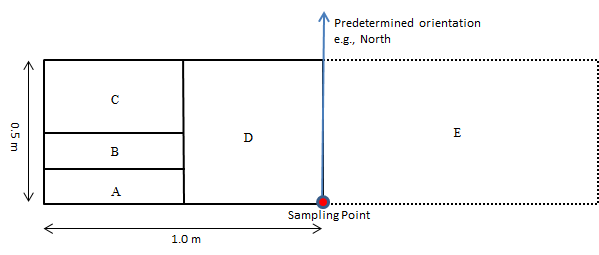

## Learning Outcomes

### Concepts

- Frequency of occurrence
- Nested sampling
- Systematic sampling
- Sampling efficiency and plot size

### Skills

- Establish and orient nested vegetation plots
- Determine whether plants are rooted within plot boundaries
- Record species occurrence using nested subplots
- Collect standardized vegetation-monitoring data

## Introduction

In the previous lab, you used the Prairie Reconstruction Initiative (PRI) meandering-walk method to develop a species list and estimate the general abundance and distribution of species across a grassland reconstruction.

In this lab, you will use the second component of the [PRI Vegetation Monitoring Protocol](https://sites.google.com/view/prairiereconinitiative/what-we-do/monitoring-protocol): **nested frequency plots**.

Unlike the meandering walk, nested plots sample vegetation at predetermined locations using a standardized plot frame. Rather than estimating abundance across the entire site, we record whether each species occurs within plots of different sizes. Repeating this procedure across many plots allows us to estimate a species' **frequency of occurrence**.

The two methods therefore provide complementary information. The meandering walk is particularly useful for developing a comprehensive species list, including uncommon species, whereas nested plots provide standardized quantitative data that can be compared among areas or through time.

## Your Assignment

Work in groups of 4–5.

In each of the two areas where you conducted a meandering walk during the previous lab:

1.  Locate the sampling points assigned to your group.
2.  Establish a nested plot at each point using the procedure below.
3.  Record the smallest subplot in which each plant species occurs.
4.  Complete **four nested plots in each area**, for a total of eight plots.
5.  Record each sampling location in ArcGIS Field Maps.

After lab, enter your group's observations into the Google Sheet provided by your instructor.

## Bring to Lab

- Field clothes suitable for walking through tall, damp grass and brush
- Field notebook
- Pencil or pen
- Mobile device for ArcGIS Field Maps
- Plant identification resources from the previous lab
- (optional) iNaturalist or another camera-equipped device for documenting unknown plants

## Nested Frequency Plots

Nested frequency plots provide a standardized way to measure how frequently plant species occur within a sampling area.

At each sampling point, you will place a plot frame containing several **nested subplots**. You begin by searching the smallest subplot, A. You then progressively expand the area searched through B, C, D, and finally E.

For each species, you record **only the smallest subplot in which it occurs**.

{#fig-nested-frame fig-alt="Diagram of the PRI nested frequency plot. A rectangular 0.5 by 1 meter frame contains nested areas A, B, C, and D. The frame is then flipped along its short side to add area E, producing a total sampled area 0.5 by 2 meters."}

The standard PRI subplot sizes are:

| Subplot |   Dimensions | Cumulative area |
|---------|-------------:|----------------:|
| A       | 12.5 × 50 cm |       0.0625 m² |
| B       |   25 × 50 cm |        0.125 m² |
| C       |   50 × 50 cm |         0.25 m² |
| D       |  50 × 100 cm |         0.50 m² |
| E       |  50 × 200 cm |         1.00 m² |

Notice that the subplots are **nested**. B includes A, C includes A and B, and D includes A, B, and C. Subplot E includes the original frame plus an equally sized area obtained by flipping the frame.

::: callout-note
## Our plot frames

For this lab, our nested plot frames are constructed from **PVC pipe**.

The outer PVC frame defines subplot D. The crossbars separating subplots **A, B, and C** are added after the frame is placed and are held in position using **rubber bands**.

Be careful not to move the outer frame while installing the crossbars. The location and orientation of the plot should remain fixed once the frame has been placed.
:::

## Why Use Nested Plots?

Suppose a species occurs in 7 of 10 plots. Its frequency at that plot size is:

$$
\text{Frequency} = \frac{7}{10} = 0.70 = 70\%
$$

Plot size matters. A common species might occur even in many of the smallest A plots, whereas a less common species may only be encountered after the sampled area is expanded to D or E.

Because the subplots are nested, a single survey provides information about species occurrence at several spatial scales without requiring five separate plots.

This also allows ecologists to evaluate what plot size provides useful information most efficiently. Very small plots may contain too few species, while very large plots may contain nearly every common species and require substantially more time to search.

## Locating and Placing a Plot

The location and orientation of a plot must be determined before examining the vegetation closely. Otherwise, observers could unconsciously move plots toward interesting plants or away from difficult vegetation, introducing sampling bias.

At each sampling point:

1.  Navigate to the assigned sampling location using ArcGIS Field Maps.
2.  Stand at the sampling point.
3.  Orient the frame in the predetermined direction specified by your instructor.
4.  Place the frame in the specified position relative to the sampling point.
5.  Carefully lower the frame through the vegetation.
6.  Add the crossbars that define subplots A, B, and C, securing them with the rubber bands.

Do not reposition the frame because another nearby location appears more interesting or easier to sample.

## What Counts as Inside the Plot?

A plant is counted based on where it is rooted, not where its leaves or stems happen to extend.

A plant rooted outside the plot does not count even if its leaves extend into the plot. A plant rooted inside the plot does count even if much of the plant extends beyond the frame.

In dense vegetation, carefully separate stems and leaves as necessary to determine where plants are rooted. Avoid pulling or damaging vegetation.

This is one of the major potential sources of error in nested-plot sampling, so group members should agree about borderline plants before recording them.

## Recording Species

Search the plot from **smallest to largest**.

### 1. Search subplot A

Identify every plant species rooted within A.

Record **A** for each species found.

### 2. Expand to subplot B

Search the additional area included in B.

Record **B only for species that were not already recorded in A**.

### 3. Expand to subplot C

Search the additional area included in C.

Record **C only for species that have not already been recorded**.

### 4. Expand to subplot D

Search the remainder of the 0.5 × 1.0 m frame.

Record **D only for species that have not already been recorded**.

### 5. Sample subplot E

After completing D, flip the frame on its short axis as shown in @fig-nested-frame.

Search the newly added area and record **E only for species that have not already been recorded**.

::: callout-important
## Record each species only once per plot

For each sampling point, a species is recorded **once**, using the letter of the **smallest subplot in which it occurred**.

For example, if Canada goldenrod occurs in A, it is recorded as **A**. You do not record it again in B, C, D, or E.

If little bluestem is absent from A, B, and C but first appears in D, record **D**.
:::

## Frequency vs. Abundance

This lab measures something different from the abundance categories you estimated during the meandering walk.

**Abundance** describes how much of a species you encounter.

**Frequency** describes how often a species occurs among sampling plots.

A species can therefore be locally abundant but have low frequency. For example, a species occurring in one dense patch could be very abundant within that patch but absent from most sampling plots.

Conversely, a species could occur as only one or two individuals in many different plots and therefore have high frequency despite never being locally abundant.

## Sources of Error

Nested plots are more standardized than a meandering walk, but they are not free from observer error. Important sources of error include:

- placing or orienting the frame inconsistently;
- moving the frame after seeing the vegetation;
- misidentifying plants;
- overlooking small or non-flowering plants;
- incorrectly deciding whether a plant is rooted inside or outside the plot; and
- recording a species in a larger subplot after it was already recorded in a smaller one.

Consistency is especially important because the purpose of standardized monitoring is to make meaningful comparisons among sampling locations and through time.

## Datasheet

Use the PRI Nested Frequency Plot datasheet for recording your observations.

[PRI Vegetation Monitoring Protocol and nested-plot resources](https://sites.google.com/view/prairiereconinitiative/what-we-do/monitoring-protocol)

The PRI monitoring page also includes a Nested Plot Demo video showing how the method is implemented in the field.

For each species at each sampling point, enter the letter corresponding to the smallest subplot (A–E) in which the species occurs. Leave the cell blank if the species does not occur anywhere in the complete plot.

## After Lab

Enter your group's nested-plot data into the class Google Sheet provided by your instructor.

When entering your data, preserve the A–E subplot codes exactly as recorded in the field. These codes allow us to calculate frequency at multiple plot sizes and compare the nested-plot results with the species information collected during the meandering walk.

## Protocol Source

This lab follows the Prairie Reconstruction Initiative (PRI) Vegetation Monitoring Protocol Framework, with modifications to equipment and sampling effort for this course.

See the [PRI Monitoring Protocol website](https://sites.google.com/view/prairiereconinitiative/what-we-do/monitoring-protocol) for the complete protocol, nested-plot demonstration, datasheets, and additional guidance.
