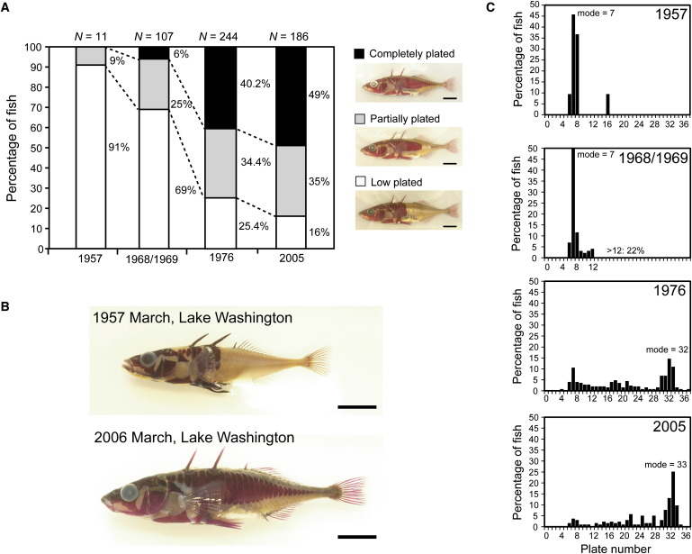
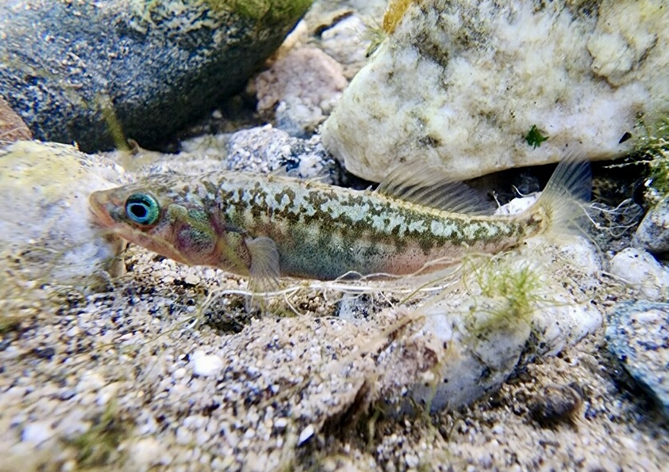
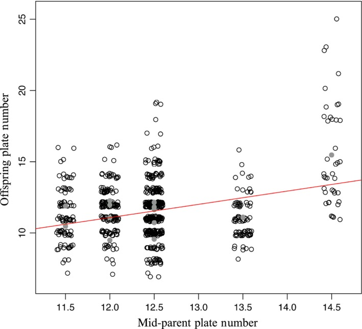

# Overview

## Evolution and Ecology Are Intertwined

::::: columns
::: {.column width="50%"}
- [Evolution]{.keyword} is change in the genetic composition of a [population]{.keyword} across [generations]{.keyword}.
- [Ecology]{.keyword} is the study of the interactions between organisms and their environment
- Ecological processes can drive evolutionary change.
:::

::: {.column width="50%"}
- Evolution can occur rapidly enough to alter ecological interactions.
- Predation, herbivory, and environmental change can all act as evolutionary forces.
:::
:::::

## Natural Selection: Three Requirements

::::: columns
::: {.column width="50%"}
Evolution by [natural selection]{.keyword} requires:

1.  Individuals vary
2.  Some variation is [heritable]{.keyword}
3.  Survival and reproduction are selective
:::

::: {.column width="50%"}
- When these conditions are met, *populations change across generations*
- Traits associated with greater [fitness]{.keyword} become more common
:::
:::::

## Individuals Are Selected; Populations Evolve

::::: columns
::: {.column width="50%"}
- Individual organisms do not evolve because they "need" to change
- Natural selection acts on existing variation among individuals
:::

::: {.column width="50%"}
- Individuals differ in survival and reproduction
- The resulting change occurs at the level of the [population]{.keyword} across generations
:::
:::::

## Evolution as Change in Allele Frequencies

::::: columns
::: {.column width="50%"}
- A [gene]{.keyword} can occur in different forms called [alleles]{.keyword}
- An individual's [genotype]{.keyword} contributes to its [phenotype]{.keyword}
:::

::: {.column width="50%"}
- Evolution can be defined precisely as change in [allele frequency]{.keyword} across generations
- Alleles associated with greater fitness tend to increase under natural selection
:::
:::::

## Four Mechanisms of Evolution

::::: columns
::: {.column width="50%"}
- [Natural selection]{.keyword}: differential survival and reproduction
- [Genetic drift]{.keyword}: random changes in allele frequencies
:::

::: {.column width="50%"}
- [Migration]{.keyword}: movement of alleles among populations
- [Mutation]{.keyword}: origin of new genetic variation
:::
:::::

## Evolution Depends on Ecological Context

::::: columns
::: {.column width="50%"}
- The fitness consequences of a trait depend on the environment
- An [adaptation]{.keyword} increases fitness under particular ecological conditions
:::

::: {.column width="50%"}
- [Trade-offs]{.keyword} mean that a trait can be beneficial in one context but costly in another
- This can produce [local adaptation]{.keyword} among populations
:::
:::::

## Evolution Is Something We Can Manage

::::: columns
::: {.column width="50%"}
- Pesticides and antibiotics impose strong natural selection
- Resistant individuals can survive and reproduce while susceptible individuals are removed
:::

::: {.column width="50%"}
- Management can alter the strength and direction of selection
- For example, refuges can preserve susceptible genotypes and slow the evolution of resistance
:::
:::::

# SimUText Debrief

## What Should We Revisit?

::::: columns
::: {.column width="50%"}
### Questions We Struggled With

- Sections 1-3 had high success rates
- Section 4 questions 14 and 15 had more confusion
:::

::: {.column width="50%"}
### What You Said Was Still Unclear

- How [multiple mechanisms of evolution]{.keyword} can act at the same time
- How quickly evolution can occur—and how we detect it
- How we determine whether a trait is [.heritable]{.keyword}
- How [gene flow]{.keyword} interacts with [natural selection]{.keyword}
- Alleles and allele-frequency changes
- Why resistance evolves and how it can be slowed
- How refuges slow the evolution of resistance
:::
:::::

## Q4.14 Resistance Does Not Evolve Because Bacteria "Need" It

::::: columns
::: {.column width="50%"}
### Where mutations come from

- Mutations do **not** occur because bacteria need them.
- Mutations arise without regard to whether they will be beneficial.
- Antibiotics **select** among variants that arise.
:::

::: {.column width="50%"}
### What the experiment shows

- Different bacterial lineages independently acquired mutations that allowed them to tolerate higher antibiotic concentrations.
- The branching pattern shows that [.antibiotic resistance]{.keyword} evolved **multiple times** during the experiment.

**Mutation creates variation; natural selection sorts it.**
:::
:::::

## Q4.15 How Does Resistance Evolve?

::::: columns
::: {.column width="50%"}
### What natural selection does not do

- Individual boll weevils did not **learn** to become resistant.
- A population does not evolve a trait simply because it **needs** that trait to survive.
- Natural selection has no goal or intended outcome.
:::

::: {.column width="50%"}
### What natural selection requires

- [.Heritable variation]{.keyword} in resistance must exist within the population.
- DDT kills susceptible individuals while resistant individuals survive and reproduce.
- Resistance can therefore become more common across generations.

**DDT does not create resistance; it selects among existing variation.**
:::
:::::

## How Fast Can Evolution Happen?

::::: columns
::: {.column width="55%"}
- Evolution does not require thousands or millions of years.
- The relevant timescale is **generations**, not simply years.
- When there is heritable variation and strong differences in [.fitness]{.keyword}, [.allele frequencies]{.keyword} can change rapidly.
- Short generation times and strong selection can make evolutionary change especially fast.

### How do we know?

Scientists can measure traits, genotypes, or allele frequencies in a population at different points in time and test whether they have changed across generations.
:::

::: {.column width="45%"}

:::
:::::

## Multiple Mechanisms Can Act at Once

::::: columns
::: {.column width="55%"}
A population can experience several mechanisms of evolution simultaneously:

- [Natural selection]{.keyword} — alleles differ in their effects on survival and reproduction
- [Genetic drift]{.keyword} — chance changes which alleles are passed on
- [Migration]{.keyword} — individuals bring alleles into or out of a population
- [Mutation]{.keyword} — new alleles arise

These mechanisms are **not mutually exclusive**. The allele frequencies we observe reflect their combined effects.
:::

::: {.column width="45%"}

:::
:::::

## How Does Gene Flow Affect Natural Selection?

::::: columns
::: {.column width="55%"}
- [Gene flow]{.keyword} occurs when migration moves alleles among populations
- Migrants can introduce alleles that natural selection favors—or alleles that selection acts against
- Continued gene flow tends to make connected populations **more genetically similar**

### The key distinction

**Gene flow describes movement of alleles. Natural selection describes differences in fitness.**

Both can change allele frequencies at the same time.
:::

::: {.column width="45%"}
:::
:::::

## How Do We Know Whether a Trait Is Heritable?

::::: columns
::: {.column width="55%"}
- [.Heritable]{.keyword} variation is variation that is at least partly caused by genetic differences among individuals.
- Similarity between parents and offspring alone does **not** prove that a trait is heritable—parents and offspring can also share environments.
- Biologists can use breeding experiments, genetic data, and other methods to separate genetic from environmental effects.

### Why it matters

Natural selection can produce evolutionary change only when differences affecting fitness are **heritable**.
:::

::: {.column width="45%"}

Offpring phenotype is related to parent phenotype. [Hansonn et al. 2016](https://pmc.ncbi.nlm.nih.gov/articles/PMC4829041/).
:::
:::::

## From Alleles to Evolution

::::: columns
::: {.column width="55%"}
- An [allele]{.keyword} is a version of a gene
- Individuals carry alleles, but we describe [allele frequencies]{.keyword} for an entire population
- If allele frequencies change from one generation to the next, the population has **evolved**

### Keep the levels straight

**Individuals:** genotype → phenotype → survival & reproduction

**Population:** allele frequencies change across generations
:::

::: {.column width="45%"}
.](images/clipboard-739969060.png)
:::
:::::

## Why Does Resistance Evolve?

::::: columns
::: {.column width="55%"}
- Pesticides and antibiotics create an environment in which resistant individuals have much higher [fitness]{.keyword} than susceptible individuals
- Resistant individuals survive and reproduce, causing resistance alleles to increase in frequency
- Strong selection can therefore cause resistance to evolve rapidly

### How can we slow it?

Reduce the consistent fitness advantage of resistance.

For example, a **refuge** allows susceptible individuals to survive and reproduce, slowing the increase of resistance alleles.

**Managing resistance means managing natural selection.**
:::

::: {.column width="45%"}
).](images/clipboard-209257233.png)
:::
:::::
