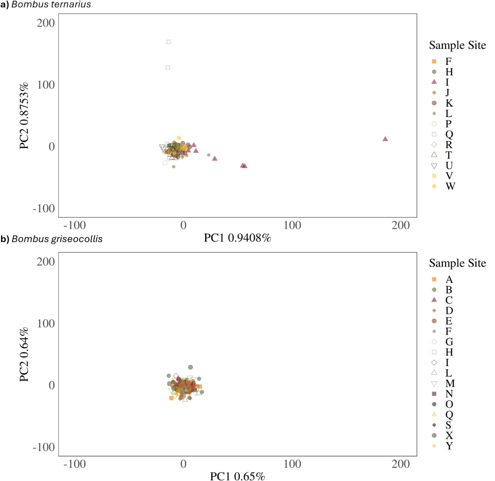

# Overview

## Evolution and Ecology Are Intertwined

::::: columns
::: {.column width="50%"}
- [Evolution]{.keyword} is change in the genetic composition of a [population]{.keyword} across [generations]{.keyword}.
- [Ecology]{.keyword} is the study of the interactions between organisms and their environment
- Ecological processes can drive evolutionary change.
:::

::: {.column width="50%"}
- Evolution can occur rapidly enough to alter ecological interactions.
- Predation, herbivory, and environmental change can all act as evolutionary forces.
:::
:::::

## Natural Selection: Three Requirements

::::: columns
::: {.column width="50%"}
Evolution by [natural selection]{.keyword} requires:

1.  Individuals vary
2.  Some variation is [heritable]{.keyword}
3.  Survival and reproduction are selective
:::

::: {.column width="50%"}
- When these conditions are met, *populations change across generations*
- Traits associated with greater [fitness]{.keyword} become more common
:::
:::::

## Individuals Are Selected; Populations Evolve

::::: columns
::: {.column width="50%"}
- Individual organisms do not evolve because they "need" to change
- Natural selection acts on existing variation among individuals
:::

::: {.column width="50%"}
- Individuals differ in survival and reproduction
- The resulting change occurs at the level of the [population]{.keyword} across generations
:::
:::::

## Evolution as Change in Allele Frequencies

::::: columns
::: {.column width="50%"}
- A [gene]{.keyword} can occur in different forms called [alleles]{.keyword}
- An individual's [genotype]{.keyword} contributes to its [phenotype]{.keyword}
:::

::: {.column width="50%"}
- Evolution can be defined precisely as change in [allele frequency]{.keyword} across generations
- Alleles associated with greater fitness tend to increase under natural selection
:::
:::::

## Four Mechanisms of Evolution

::::: columns
::: {.column width="50%"}
- [Natural selection]{.keyword}: differential survival and reproduction
- [Genetic drift]{.keyword}: random changes in allele frequencies
:::

::: {.column width="50%"}
- [Migration]{.keyword}: movement of alleles among populations
- [Mutation]{.keyword}: origin of new genetic variation
:::
:::::

## Evolution Depends on Ecological Context

::::: columns
::: {.column width="50%"}
- The fitness consequences of a trait depend on the environment
- An [adaptation]{.keyword} increases fitness under particular ecological conditions
:::

::: {.column width="50%"}
- [Trade-offs]{.keyword} mean that a trait can be beneficial in one context but costly in another
- This can produce [local adaptation]{.keyword} among populations
:::
:::::

## Evolution Is Something We Can Manage

::::: columns
::: {.column width="50%"}
- Pesticides and antibiotics impose strong natural selection
- Resistant individuals can survive and reproduce while susceptible individuals are removed
:::

::: {.column width="50%"}
- Management can alter the strength and direction of selection
- For example, refuges can preserve susceptible genotypes and slow the evolution of resistance
:::
:::::

# SimUText Debrief

## What Should We Revisit?

::::: columns
::: {.column width="50%"}
### Questions We Struggled With

- Sections 1-3 had high success rates
- Section 4 questions 14 and 15 had more confusion
:::

::: {.column width="50%"}
### What You Said Was Still Unclear

- How [multiple mechanisms of evolution]{.keyword} can act at the same time
- How quickly evolution can occur—and how we detect it
- How we determine whether a trait is [.heritable]{.keyword}
- How [gene flow]{.keyword} interacts with [natural selection]{.keyword}
- Alleles and allele-frequency changes
- Why resistance evolves and how it can be slowed
- How refuges slow the evolution of resistance
:::
:::::

## Q4.14 Resistance Does Not Evolve Because Bacteria "Need" It

::::: columns
::: {.column width="50%"}
### Where mutations come from

- Mutations do **not** occur because bacteria need them.
- Mutations arise without regard to whether they will be beneficial.
- Antibiotics **select** among variants that arise.
:::

::: {.column width="50%"}
### What the experiment shows

- Different bacterial lineages independently acquired mutations that allowed them to tolerate higher antibiotic concentrations.
- The branching pattern shows that [.antibiotic resistance]{.keyword} evolved **multiple times** during the experiment.

**Mutation creates variation; natural selection sorts it.**
:::
:::::

## Q4.15 How Does Resistance Evolve?

::::: columns
::: {.column width="50%"}
### What natural selection does not do

- Individual boll weevils did not **learn** to become resistant.
- A population does not evolve a trait simply because it **needs** that trait to survive.
- Natural selection has no goal or intended outcome.
:::

::: {.column width="50%"}
### What natural selection requires

- [.Heritable variation]{.keyword} in resistance must exist within the population.
- DDT kills susceptible individuals while resistant individuals survive and reproduce.
- Resistance can therefore become more common across generations.

**DDT does not create resistance; it selects among existing variation.**
:::
:::::

## What Is an Allele?

::::: columns
::: {.column width="50%"}
- A [gene]{.keyword} is a region of DNA with a particular function
- An [allele]{.keyword} is a **version of a gene**
- In diploid organisms, individuals usually carry **two copies of each gene**—one from each parent
- The two copies may contain the **same or different alleles**

**An individual's combination of alleles is its [genotype]{.keyword}.**
:::

::: {.column width="50%"}
{fig-alt="Diagram of a threespine stickleback, a pair of homologous chromosomes, and the Eda gene. The gene occurs at the same position on both chromosomes, with one copy carrying the complete-plating allele and the other the low-plating allele."}
:::
:::::

## From Allele Frequencies to Evolution

::::: columns
::: {.column width="55%"}
- Individuals **carry alleles**
- Populations have [allele frequencies]{.keyword}: the proportion of gene copies carrying each allele
- Scientists can estimate allele frequencies **across generations**

**Evolution is a change in allele frequencies across generations.**
:::

::: {.column width="45%"}
{fig-alt="Graphs showing changes in armor plate number, plate morph frequencies, and Eda allele frequencies in Lake Washington threespine sticklebacks over time."}
:::
:::::

## How Fast Can Evolution Happen?

::::: columns
::: {.column width="55%"}
- Evolution does **not** require thousands or millions of years
- The relevant timescale for evolution is **generations**, not simply years
- Allele frequencies can change as populations reproduce through successive generations
- With strong selection, substantial evolutionary change can occur in **relatively few generations**
:::

::: {.column width="45%"}
.](images/yamasaki-2026-stickleback-evolution.png){fig-alt="Graphs showing changes in armor plate number, plate morph frequencies, and Eda allele frequencies in Lake Washington threespine sticklebacks over time."}
:::
:::::

## Multiple Mechanisms Can Act at Once

::::: columns
::: {.column width="55%"}
A population can experience several mechanisms of evolution simultaneously:

- [Mutation]{.keyword} can introduce a new allele
- [Migration]{.keyword} can move alleles between populations
- [Genetic drift]{.keyword} can change allele frequencies by chance
- [Natural selection]{.keyword} can favor some alleles over others

**All of these processes can affect the same population at the same time.**

The allele frequencies we observe reflect their **combined effects**.
:::

::: {.column width="45%"}
Example: a beneficial allele might be favored by selection, while migration brings in an alternative allele and drift causes random fluctuations in both.

:::
:::::

## How Does Gene Flow Affect Natural Selection?

::::: columns
::: {.column width="50%"}
- [Migration]{.keyword} moves individuals among populations
- Migration + movement of alleles = [gene flow]{.keyword}
- [Natural selection]{.keyword} favors alleles associated with higher fitness
- Gene flow and selection can move allele frequencies in the **same or opposite directions**
:::

::: {.column width="50%"}
{fig-alt="Diagram showing a striped beetle migrating from a population of striped beetles toward a population of unstriped beetles, with an arrow labeled \"Gene flow.\""}
:::
:::::

## Example: Gene Flow Can Oppose Local Adaptation

::::: columns
::: {.column width="50%"}
- *Timema cristinae* occurs as **striped and unstriped morphs**
- Striped insects are better camouflaged on *Adenostoma*; unstriped insects on *Ceanothus*
- Natural selection therefore favors different morphs on the two hosts.

.](images/farkas-2013-timema-morphs-hosts.jpg){width="50%"}
:::

::: {.column width="50%"}
- Selection removes poorly camouflaged morphs, while gene flow keeps bringing their alleles back in.

.](images/bolnick-nosil-2007-gene-flow-maladaptive-morphs.gif){fig-alt="Graph showing a low frequency of maladaptive color morphs in isolated allopatric Timema cristinae populations and a higher frequency in adjacent parapatric populations experiencing gene flow." width="70%"}
:::
:::::

## How Do We Know Whether a Trait Is Heritable?

::::: columns
::: {.column width="50%"}
- Measure a trait in **parents and offspring**
- Test whether offspring tend to **resemble their parents**
- Account for **shared environmental effects** that could also cause resemblance

**Parent–offspring resemblance can provide evidence that variation is heritable.**
:::

::: {.column width="50%"}
.](images/hansson-2016-parent-offspring-plate-number.png){fig-alt="Scatterplot of offspring plate number versus mid-parent plate number, showing a positive relationship: parents with more plates tend to have offspring with more plates."}
:::
:::::

## Why Does Resistance Evolve?

- [Mutation]{.keyword} creates new alleles at random with respect to their effects; a tiny fraction happen to confer resistance
- Pesticides and antibiotics give resistant individuals a large [fitness]{.keyword} advantage
- Resistant individuals survive and reproduce → resistance alleles increase in frequency
- Strong selection can cause resistance to evolve rapidly

**Mutation creates variation; natural selection changes its frequency.**

## How Can We Slow Resistance Evolution?

::::: columns
::: {.column width="55%"}
Reduce the **selection for resistance**.

- A **refuge** is a nearby area where individuals are not exposed to the control agent
- Susceptible individuals survive and reproduce in the refuge
- Other strategies can also reduce the reproductive success of resistant individuals
- [Migration]{.keyword} brings susceptible and resistant individuals together → mating causes [gene flow]{.keyword}
- Other strategies can also reduce the reproductive success of resistant individuals

**Managing resistance means managing natural selection.**
:::

::: {.column width="45%"}
.](images/tabashnik-2005-management-strategies.png)
:::
:::::

# Applications

## The Growing Season Is Getting Longer

::::: columns
::: {.column width="35%"}
Since 1970, Fargo's **freeze-free season has lengthened by about three weeks**.

A longer freeze-free season can change:

- timing of **spring warming**
- exposure to **late freezes**
- accumulation of **growing degree days**
- timing of **fall freezes**

These changes can alter the **costs and benefits of seasonal timing** for organisms.
:::

::: {.column width="65%"}
, [CC BY 4.0](https://creativecommons.org/licenses/by/4.0/).](images/fargo-freeze-free-growing-season-trend.jpg){fig-alt="Line graph of Fargo's annual freeze-free growing season from 1970 to 2025. The number of freeze-free days varies substantially among years but shows a long-term increasing trend of 22 days over the period."}
:::
:::::

## Changing Seasons Affect Organisms

[Phenology]{.keyword} is the timing of recurring biological events.

Examples include:

- budburst, leaf-out, flowering, and seed production
- insect emergence
- breeding and reproduction
- migration
- hibernation and dormancy

Changes in phenology can have **other ecological consequences** — for individuals, populations, and interactions among species.

## How Might Organisms Respond?

### In groups of 3–4:

Choose an organism and predict **one or more biological changes** that could result from Fargo's longer growing season.

Start with a change in **phenology**, then consider its consequences.

Be specific:

**What would change? How would you measure it?**

Be ready to share your prediction with the class.

## Is It Evolution?

::: incremental
- A change in a **phenotypic trait** could result from:

  - [Phenotypic plasticity]{.keyword}: Same genotype → different phenotype in a different environment

  - [Evolution]{.keyword}: Heritable variation → allele frequencies change through time
:::

## What Evidence Could Distinguish Evolution from Plasticity?

::: incremental
- **Common garden:** raise individuals from different populations under the same conditions → do differences persist?
- **Environmental experiment:** expose the same populations to different temperatures → does phenology change?
- **Parents and offspring:** do differences in phenology resemble those of their parents when raised under similar conditions?
- **Genetic change:** do alleles associated with phenology change in frequency through time?
- **Evolution requires heritable change in a population — not just a change in phenotype.**
:::

## Bumble Bees Across North Dakota

::::: columns
::: {.column width="50%"}
Researchers sampled two widespread bumble bees across North Dakota:

- *Bombus ternarius* — 161 bees from 13 sites
- *Bombus griseocollis* — 198 bees from 17 sites

They compared **tens of thousands of genetic variants** among bees from different parts of the state.

**Are populations genetically isolated — or are alleles moving across North Dakota?**
:::

::: {.column width="50%"}
, [CC BY 4.0](https://creativecommons.org/licenses/by/4.0/).](images/hall-2026-north-dakota-bumble-bees.png){fig-alt="Photographs of the tricolored bumble bee, Bombus ternarius, and brown-belted bumble bee, Bombus griseocollis, alongside a map of North Dakota showing sampling sites for both species distributed across the state."}
:::
:::::

## These Populations Are Genetically Very Similar

::::: columns
::: {.column width="50%"}
Across North Dakota:

- Bees from different sites **do not form distinct genetic clusters**
- Genetic differentiation among sites is extremely low
- This suggests extensive [gene flow]{.keyword} across the landscape

**So how could local adaptation occur?**
:::

::: {.column width="50%"}
PCA shows most points cluster near each other (a single cloud of points), indicating little genetic differentiation

{fig-alt="Principal component plots of genetic variation in Bombus ternarius and Bombus griseocollis from sampling sites across North Dakota. Points representing different sampling locations overlap extensively, indicating very little overall genetic differentiation among sites." width="513"}
:::
:::::

## Selection Can Act Despite Gene Flow

::::: columns
::: {.column width="50%"}
- Most of the genome is **similar across North Dakota**

- But some genetic variants were associated with environmental differences in temperature, precipitation, land cover

- [Gene flow]{.keyword} mixes alleles across the landscape, while [natural selection]{.keyword} can favor particular alleles under different conditions.
:::

::: {.column width="50%"}
, [CC BY 4.0](https://creativecommons.org/licenses/by/4.0/).](images/hall-2026-bumble-bee-local-adaptation.png){fig-alt="Redundancy analysis plots for two North Dakota bumble bee species showing associations between genetic variants and environmental variables. Environmental vectors represent gradients in climate and land cover, and highlighted genetic variants indicate candidate loci associated with those gradients." width="369"}
:::
:::::

::: notes
- **RDA plot** = associations between genetic variation and environment
- **SNP** = single DNA position with different alleles among individuals
- **Each small point** = one SNP
- **Highlighted points** = candidate SNPs unusually strongly associated with environment
- **Arrow** = one environmental variable
- **Arrow direction** = direction that environmental variable increases
- SNPs **in direction of arrow** → allele frequencies positively associated with that variable
- SNPs **opposite arrow** → negatively associated
- **Longer arrows** = stronger contribution to genetic variation
- Similar arrow directions → environmental variables **positively correlated**
- Opposing arrows → variables **negatively correlated**
- Figure 3: high gene flow → little genome-wide differentiation
- Figure 4: environment ↔ variation at **particular loci**
- Caveat: **association ≠ adaptation**; no demonstrated effect on phenotype or fitness
:::

## Conservation application

- Gene flow can help populations maintain the **genetic variation needed to respond to environmental change**.

- To conserve these species:

  - maintain **connected habitat** that allows movement and gene flow

  - protect populations across **different environments** so locally favored variation is not lost

## Can Trees Keep Up With Climate Change?

Tree populations can become **locally adapted** to their climate

But climate is changing faster than trees can respond:

- long [generation times]{.keyword} → slow evolutionary change
- limited seed dispersal → slow movement of populations and genes

As climate warms, locally adapted populations may become **poorly matched to their environment**.

## Could we move better-adapted genes ourselves?

::::: columns
::: {.column width="43%"}
Historically: **local seed sources** assumed best adapted to local conditions

But today's climate ≠ the climate those populations evolved in

Study by Etterson et al. 2020:

- **16 planting sites** across northeastern Minnesota
- **Bur oak + northern red oak** grown from northern vs. southern Minnesota seed sources
- Same planting sites → test whether **seed source affects survival, growth, and phenology**
:::

::: {.column width="57%"}
, [CC BY-NC 4.0](https://creativecommons.org/licenses/by-nc/4.0/).](images/etterson-2020-study-design.jpg){fig-alt="Map of Minnesota showing northern and southern seed-source zones for bur oak and northern red oak and 16 experimental planting sites in northeastern Minnesota. Trees originating from both seed zones were planted at the northern sites to compare their performance under the same local conditions." width="247"}
:::
:::::

::: notes
- Question: **Is "local seed is best" still true as climate warms?**
- Oaks collected from **northern vs. southern Minnesota seed zones**
- Seeds grown into seedlings → planted at **16 northeastern Minnesota sites**
- Northern + southern sources planted at the **same sites** → shared environments
- Compared **survival, growth, and phenology**
- If southern sources perform better in the north → possible **adaptation lag** in local populations
- Management question → should forestry move **warmer-adapted genetic material northward?**

**Connection to earlier activity:** essentially a **common-garden/provenance experiment** — compare different genetic sources under the same environmental conditions.
:::

## Southern Trees Are Already Doing Better

::::: columns
::: {.column width="43%"}
After three years:

- Survival was **high overall**
- Southern-source **red oak** survived better and grew faster than northern-source trees
- Seed sources also differed in **seasonal traits** such as budburst and leaf retention

Local trees are not necessarily the **best performers under today's climate**.

This may indicate an **adaptation lag** as climate warms.
:::

::: {.column width="57%"}
- Compare **northern vs. southern seed sources**
- Strongest advantage for **southern-source red oak**
- Bur oak responses were **weaker/more variable**
:::
:::::

## Southern-Source Red Oaks Are Doing Better

::::: columns
::: {.column width="43%"}
After three years:

- Survival was **high overall**
- Southern-source **red oak** survived better and grew faster than northern-source trees
- Seed sources also differed in **seasonal traits** such as budburst and leaf retention

Local trees are not necessarily the **best performers under today's climate**.

This may indicate an **adaptation lag** as climate warms.
:::

::: {.column width="57%"}
- Compare **northern vs. southern seed sources**
- Strongest advantage → **southern-source red oak**
- Bur oak responses → **weaker or more variable**

.](images/etterson-2020-oak-performance.jpg){fig-alt="Graphs comparing survival, growth, and seasonal traits of bur oak and northern red oak seedlings from northern and southern Minnesota seed sources. Differences between seed sources vary by species and trait, with southern-source red oak showing the clearest advantages in survival and growth."}
:::
:::::

::: notes
- Figure 2 = **results from the experiment on previous slide**
- Compare **light vs. dark bars within each species** = different seed sources
- Same northern planting environments → differences associated with **seed source**
- Red oak = clearest result: **southern source survived better + grew faster**
- Bur oak = **weaker/mixed response** → not simply "southern is always better"
- Phenology also differs → genetic source affects **seasonal timing**
- Key result: **local source ≠ necessarily best performer**
- Possible **adaptation lag** = local populations adapted to past climate, while environment is changing rapidly
- Does not prove southern sources will always be best → short-term experiment + species-specific responses
- Sets up management question: **should managers deliberately move southern genetic material north?**
:::

## Assisted Migration: Moving Genes on Purpose

[Assisted migration]{.keyword} can help forests keep pace with a rapidly changing climate.

**What should managers do?**

- Don't assume **local seed is always best**
- Include genetically diverse seed from **somewhat warmer locations farther south**
- Plant a **mixture of sources** rather than betting on a single "best" genotype
- Monitor survival and growth → **adjust future planting decisions**

This accelerates [gene flow]{.keyword}, giving natural selection **more genetic variation to work with**.

::: notes
- **Assisted migration** = intentionally moving seeds/genes in direction climate is shifting
- Not "replace northern trees with southern trees"
- Better strategy = **increase genetic diversity + hedge bets**
- Etterson study → evidence that strict **"local is best"** assumption can fail under changing climate
- Southern red oak result especially strong; **not universal across species**
- TNC → actively sourcing some seed from **central Minnesota for northern plantings**
- TNC northern MN program → **\>3 million trees/year**
- MN DNR → climate considered in reforestation + assisted seed movement/seed-transfer planning
- Management goal = forests capable of surviving **future climate**, not just today's climate
- Evolution connection: managers alter **gene flow** → introduce potentially useful alleles → selection still determines which succeed
- Important distinction: assisted migration **facilitates evolution; managers aren't choosing the winning alleles themselves**
:::

## This is already happening in Minnesota

::::: columns
::: {.column width="50%"}
- **Forests:** TNC, Minnesota DNR, and partners are incorporating seed from **warmer locations farther south** into northern restoration
- **Grasslands:** TNC is using **multiple seed sources** to increase genetic diversity and adaptive potential in prairie restorations ([Lindstrom et al 2023 *Ecol Evol*](https://doi.org/10.1002/ece3.10756)).
- Same principle → restoration can manage **genetic variation and gene flow**, not just species composition
:::

::: {.column width="50%"}
{fig-alt="Screenshot of a 2026 Nature Conservancy article titled 'TNC Plants 3.2 Million Trees in Minnesota,' describing a large-scale tree planting effort across northern Minnesota to establish more diverse and climate-resilient forests."}
:::
:::::

## What Do These Examples Have in Common?

:::::: columns
::: {.column width="30%" style="text-align:center;"}
### Changing Seasons

**Environmental change**

↓

Changes in phenology

↓

**Plasticity or evolution?**
:::

::: {.column width="30%" style="text-align:center;"}
### Bumble Bees

**Different environments**

↓

Selection favors different alleles

↕

**Gene flow mixes populations**
:::

::: {.column width="30%" style="text-align:center;"}
### Forest Restoration

**Rapid climate change**

↓

Local populations may lag behind

↓

Managers alter **gene flow + genetic variation**
:::
::::::

## Discuss with your group

Using these examples, formulate **one general principle** about how populations evolve in changing environments.

Think about:

**genetic variation · natural selection · gene flow**

::: notes
- Don't explain the three examples again — students have just seen them
- Point to each column → ask what evolutionary problem/process it illustrates
- Give groups \~1–2 min: formulate **one general principle** connecting the examples
- Ask 2–3 groups to share
- Then reveal the synthesis statement
- Phenology → environment changes phenotype; need to distinguish **plasticity vs. heritable change**
- Bumble bees → **selection + gene flow** can act simultaneously
- Trees → managers can change the **genetic variation available to selection**
- Broader lesson → ecology determines the selective environment; evolution changes populations in response
- Transition → **Key Takeaways**
:::

## Populations can only evolve from the genetic variation available to them. Selection, gene flow, drift, and mutation determine how that variation changes through time.

# Key Takeaways

## Evolution in Ecological Time

- Evolution = change in **allele frequencies through time**
- [Natural selection]{.keyword}, [genetic drift]{.keyword}, [migration]{.keyword}, and [mutation]{.keyword} can act **simultaneously**
- Evolution can occur over **ecologically relevant timescales**
- Environmental change can alter **which traits and alleles are favored**
- [Gene flow]{.keyword} can either **reinforce or oppose local adaptation**
- Evolutionary thinking has practical consequences for **conservation and management**

# Looking Ahead

## From Evolution to Physiological Ecology

**Evolution doesn't stop being relevant when we leave the evolution chapter.**

Next, we'll ask how organisms **function in their environments**:

- How do **climate and physical conditions** shape where species can live?
- How can individuals [acclimate]{.keyword} to changing conditions?
- How does **adaptation** differ from acclimation?
- How do organisms maintain [homeostasis]{.keyword}?
- How does plant metabolism respond to the environment?

**Evolution underlies all of these questions.**

The traits that allow organisms to survive, function, and reproduce in particular environments are themselves products of **evolutionary history**.

::: notes
- Evolution is not a topic we're now "done with"
- It will underlie essentially **everything else in ecology**
- Physiological ecology → focus shifts from **how populations change** to **how organisms function**
- Climate activity provides direct bridge:
  - acclimation/plasticity → individual response within lifetime
  - adaptation → heritable differences shaped by evolution
- Climate + physiology help determine **species distributions**
- Biomes → large-scale patterns in climate + organisms adapted to those conditions
- Homeostasis → physiological mechanisms organisms use to function despite environmental variation
- Plant metabolism → photosynthesis/respiration constrained by temperature, water, light, etc.
- Keep asking throughout course: **Why does this organism have these traits? What environmental conditions shaped them?**
- Evolution remains the underlying explanation even when it is not the explicit subject
:::
