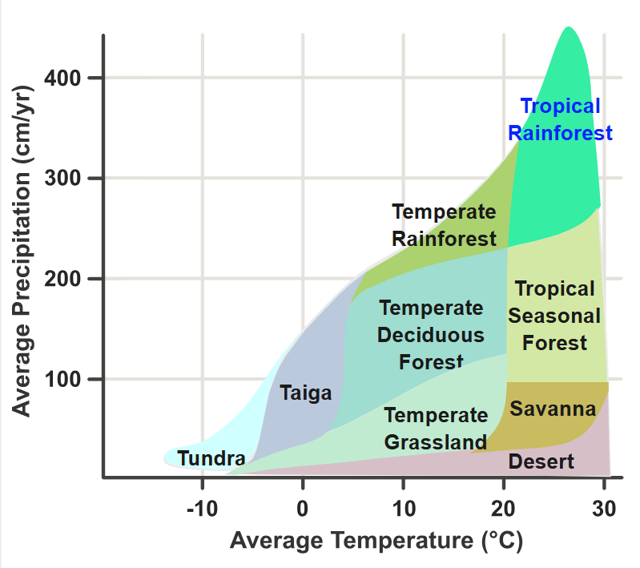
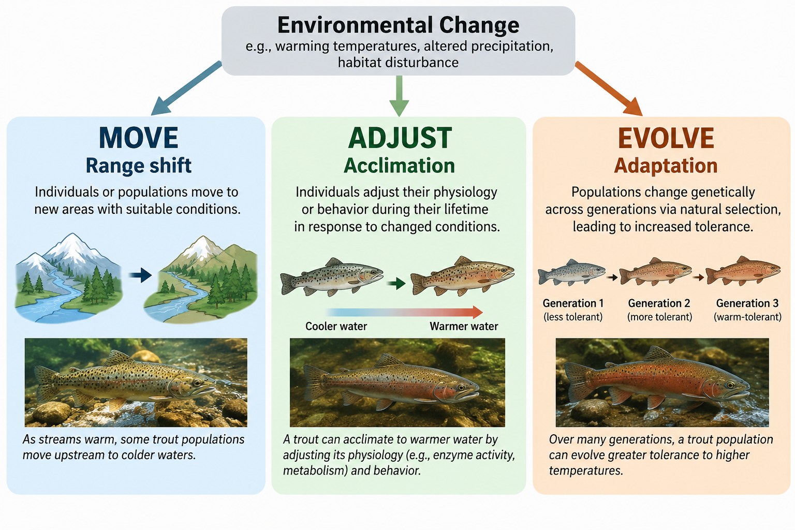
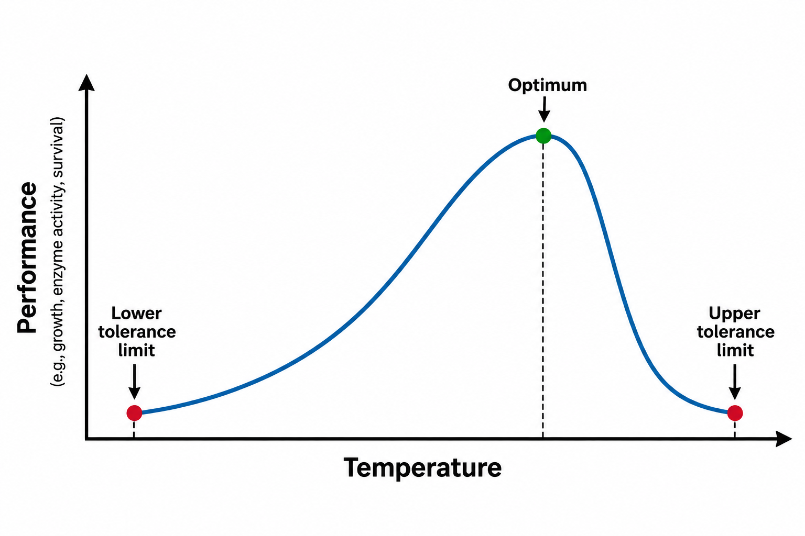
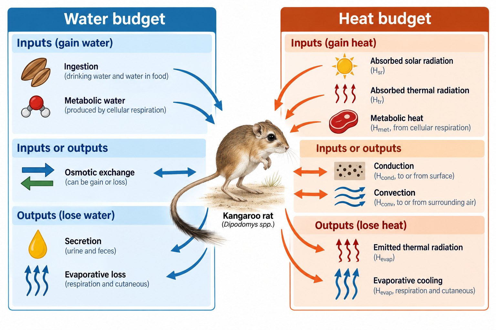

# Overview

## Physiological ecology: the big picture

::::: columns
::: {.column width="50%"}
[Physiology]{.keyword} explains how organisms function.

[Physiological ecology]{.keyword} asks how those functions interact with the environment.

Organisms must:

- acquire [energy]{.keyword} and [nutrients]{.keyword}

- maintain internal conditions

- survive environmental stress

- reproduce where conditions permit
:::

::: {.column width="50%"}
, [CC BY 2.0](https://creativecommons.org/licenses/by/2.0/).](images/morro-bay-kangaroo-rat.jpg){fig-alt="Morro Bay kangaroo rat standing on sandy ground."}
:::
:::::

## Climate sets the stage

::::: columns
::: {.column width="50%"}
Plant communities often look similar when they experience similar [climate]{.keyword}, even if they are geographically distant.

Two major drivers:

- [temperature]{.keyword}
- [precipitation]{.keyword}

Together, they help explain [biomes]{.keyword} and [species distributions]{.keyword}.
:::

::: {.column width="50%"}
{fig-alt="Whittaker diagram plotting average annual precipitation against average temperature, with regions showing the climatic ranges of tundra, taiga, temperate grassland, temperate deciduous forest, temperate rainforest, desert, savanna, tropical seasonal forest, and tropical rainforest."}
:::
:::::

## Water availability is not just rainfall

::::: columns
::: {.column width="50%"}
[Potential evapotranspiration (PET)]{.keyword}

How much water **could** be lost through evaporation and transpiration if water were unlimited.

- Driven primarily by [temperature]{.keyword}
- Higher temperature → higher PET
:::

::: {.column width="50%"}
[Actual evapotranspiration (AET)]{.keyword}

How much water is **actually** lost through evaporation and transpiration.

- Limited by [water availability]{.keyword}
- When precipitation cannot keep up with PET, organisms may experience [water stress]{.keyword}
:::
:::::

## Environmental change: three responses

::::: columns
::: {.column width="50%"}
When environmental conditions change, organisms may:

- move → [range shift]{.keyword}
- adjust → [acclimation]{.keyword}
  - occurs within an individual's lifetime
  - does not require genetic change
- evolve → [adaptation]{.keyword}
  - occurs across generations
  - results from evolution by natural selection
:::

::: {.column width="50%"}
{fig-alt="Conceptual diagram showing three trout responses to environmental change. In the first pathway, trout move to a new area, representing a range shift. In the second, an individual trout adjusts to warmer water, representing acclimation within its lifetime. In the third, trout become increasingly tolerant across generations, representing adaptation by natural selection."}
:::
:::::

## Temperature affects performance

::::: columns
::: {.column width="50%"}
This is where [ecology]{.keyword} connects to [chemistry]{.keyword}.

Temperature affects [enzyme activity]{.keyword}, which typically follows a [thermal performance curve]{.keyword}:

- increases with temperature
- reaches an [optimum]{.keyword}
- declines at high temperatures

**Molecular processes can ultimately limit where organisms live.**
:::

::: {.column width="50%"}
{fig-alt="Asymmetric thermal performance curve with temperature on the x-axis and performance on the y-axis. Performance rises gradually from the lower tolerance limit to an optimum, then declines steeply toward the upper tolerance limit."}
:::
:::::

## Homeostasis is a balancing act

::::: columns
::: {.column width="50%"}
[Homeostasis]{.keyword} is the maintenance of relatively stable internal conditions despite a changing environment.

We can understand homeostasis using [budgets]{.keyword}:

**net balance = inputs − outputs**

Two important examples:

- [water budget]{.keyword}: water gained vs. water lost
- [heat budget]{.keyword}: heat gained vs. heat lost

For a stable internal condition, **inputs must balance outputs**.
:::

::: {.column width="50%"}
{fig-alt="Diagram of water and heat budgets surrounding a kangaroo rat. Water inputs are ingestion and metabolic water; osmotic exchange can be an input or output; and secretion and evaporative loss are outputs. Heat inputs are absorbed solar radiation, absorbed thermal radiation, and metabolic heat; conduction and convection can be inputs or outputs; and emitted thermal radiation and evaporative cooling are outputs."}
:::
:::::

## Plants balance carbon gain against water loss

::::: columns
::: {.column width="50%"}
Plants need [CO₂]{.keyword} for photosynthesis—but obtaining it comes at a cost.

Opening [stomata]{.keyword} allows CO₂ in, but water escapes through [transpiration]{.keyword}.

Transpiration also:

- moves water and nutrients

- cools leaves

Excessive water loss can increase the risk of [cavitation]{.keyword} (bubbles stop water flow).

[C3, C4, and CAM photosynthesis]{.keyword} represent different strategies for balancing CO₂ uptake, water loss, and [photorespiration]{.keyword} under different environmental conditions.
:::

::: {.column width="50%"}
:::
:::::

# SimUText Debrief

## Acclimation can be reversible or irreversible

[Reversible acclimation]{.keyword} can be undone when conditions change.

- growing a thicker winter coat
- increasing red blood cell production at high altitude
- producing more heat-shock proteins during heat stress

[Irreversible acclimation]{.keyword} occurs during development and persists.

- developing larger lungs at high altitude
- changing body size or proportions during growth
- developing different leaf structure under sun vs. shade

## Photosynthetic pathways shape plant distributions

::: list-table
- 

  - 

  - **C3**

  - **C4**

  - **CAM**

- 

  - **Terrestrial spp.**
  - \~90%
  - \~3%
  - \~6%

- 

  - **Environment**
  - Widely varies
  - Hot, dry
  - Hot, dry

- 

  - **CO₂ separation**
  - None
  - Spatial
  - Temporal

- 

  - **Photorespiration**
  - Normal
  - Reduced
  - Reduced

- 

  - **Water efficiency**
  - Normal
  - Improved
  - Very improved

- 

  - **Metabolic cost**
  - Lower
  - Higher
  - Higher
:::

## Review SimuText on

- H_net equation

- CAM - open stomata to take in CO2 at night, reducing transpiration
