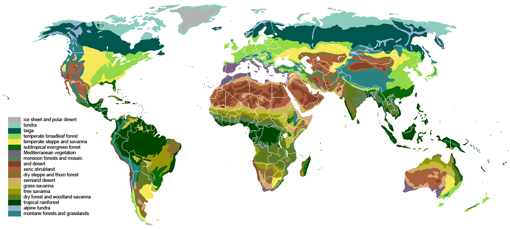
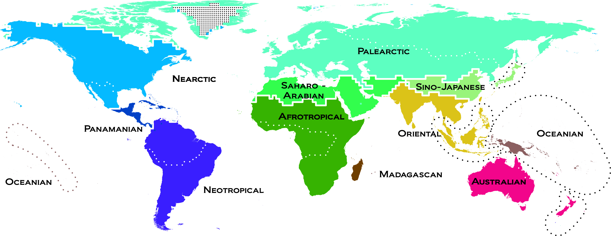
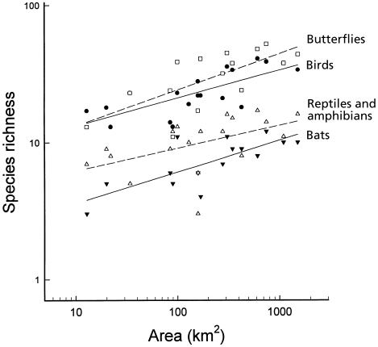
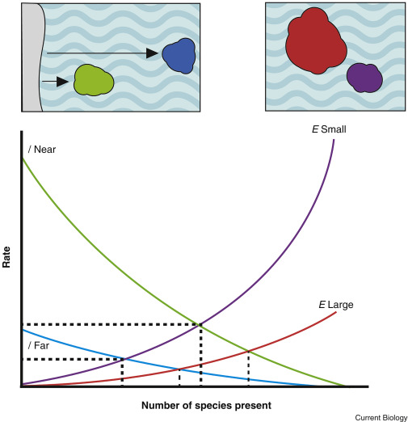
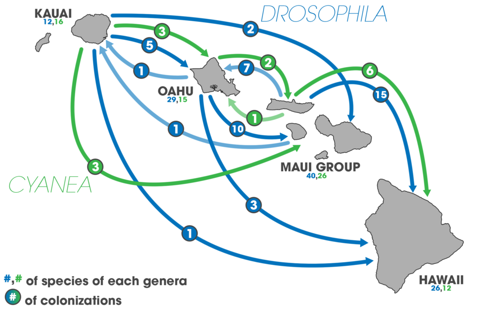
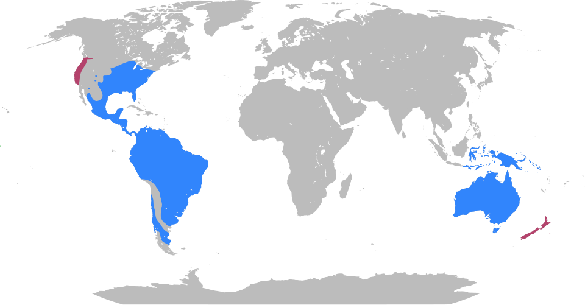

## Biogeography explains where life is — and why

:::::: columns
::: {.column width="50%"}
- [Biogeography]{.keyword}: geographic distribution of species
- Two lenses:
  - [Ecological biogeography]{.keyword}: conditions now
  - [Historical biogeography]{.keyword}: events over time
- Core question:
  - Why here?
  - Why not there?
:::

:::: {.column width="50%"}
::: {#fig-biogeography-layout layout-ncol="2"}
{#fig-biomes}

{#fig-realms}
:::
::::
::::::

## Diversity changes with the scale of the question

::::: columns
::: {.column width="50%"}
- [Species richness]{.keyword}: number of species
- [Alpha diversity]{.keyword}: local richness
- [Beta diversity]{.keyword}: turnover among sites
- [Gamma diversity]{.keyword}: regional richness
- Same landscape, different answers
:::

::: {.column width="50%"}
{fig-alt="Diagram showing several circular local samples within a larger region. Alpha diversity represents diversity within each sample, gamma diversity represents diversity across the entire region, and beta diversity represents differences in species composition among samples."}
:::
:::::

## Counting species depends on sampling effort

::::: columns
::: {.column width="50%"}
- [Species-accumulation curve]{.keyword}
  - species found × sampling effort
  - should level off if sampling is complete
- Main point:
  - observed richness ≠ true richness
  - more sampling usually finds more species
:::

::: {.column width="50%"}
{fig-alt="Species-accumulation curve showing cumulative termite species richness increasing rapidly during early sampling and then increasing more slowly as the number of sampled transect sections approaches 40."}
:::
:::::

## Bigger areas usually hold more species

::::: columns
::: {.column width="50%"}
- [Species-area curve]{.keyword}
  - species richness × area
- Larger areas often contain:
  - more individuals
  - more habitat types
  - lower extinction risk
- [Species-habitat diversity hypothesis]{.keyword}
  - more area → more habitats → more species
:::

::: {.column width="50%"}
{fig-alt="Scatterplot showing the positive species–area relationship for breeding land birds on Lesser Antillean islands. Larger islands generally support more bird species than smaller islands."}
:::
:::::

## Island diversity is a balance, not a fixed list

::::: columns
::: {.column width="50%"}
- [Equilibrium theory of island biogeography]{.keyword}
- Two opposing processes:
  - [Immigration]{.keyword}: species arrive
  - [Extinction]{.keyword}: species disappear
- [Equilibrium species richness]{.keyword}: number stays stable
- [Equilibrium turnover rate]{.keyword}: identities keep changing
:::

::: {.column width="50%"}

:::
:::::

## Dispersal depends on the organism and the barrier

::::: columns
::: {.column width="50%"}
- [Dispersal]{.keyword}: movement to a new area
- Barrier types:
  - [Corridor]{.keyword}: most can cross
  - [Filter]{.keyword}: some can cross
  - [Sweepstakes route]{.keyword}: rare crossing events
- Crossing mechanisms:
  - [Jump dispersal]{.keyword}: rapid, long-distance jump
  - [Diffusion]{.keyword}: slow spread outward
  - [Secular migration]{.keyword}: spread slow enough for evolution en route
:::

::: {.column width="50%"}
{fig-alt="Map of the Hawaiian Islands showing inferred colonization routes among islands for Drosophila flies and Cyanea plants. Arrows connect islands where lineages dispersed across ocean barriers, with the two groups showing different patterns of movement."}
:::
:::::

## Geography changes, so evolution changes

::::: columns
::: {.column width="50%"}
- [Plate tectonics]{.keyword} rearranges land and sea
- Isolation can produce [allopatric speciation]{.keyword}
- Two historical routes:
  - dispersal: organisms move
  - [vicariance]{.keyword}: barriers split populations
- [Sympatric speciation]{.keyword}
  - speciation without geographic isolation
:::

::: {.column width="50%"}

:::
:::::

## Species richness usually increases toward the equator

:::: columns
::: {.column width="50%"}
- [Latitudinal gradient]{.keyword}
  - low latitude: more species
  - high latitude: fewer species
- Important point:
  - pattern is strong
  - explanation is not simple
- Likely causes:
  - energy
  - climate stability
  - evolutionary time
  - area
:::
::::

## Climate organizes life at global scales

::::: columns
::: {.column width="50%"}
- [Biome]{.keyword}
  - broad climate + plant structure
- Similar climates can produce similar-looking communities
- Different species, similar forms
- Do not confuse:
  - biome = climate/vegetation structure
  - [biogeographic realm]{.keyword} = evolutionary history
:::

::: {.column width="50%"}
{fig-alt="World map of terrestrial vertebrate species richness, colored from blue for lower richness to red for higher richness. The highest richness is concentrated in tropical regions near the equator, particularly northern South America, central Africa, and Southeast Asia, while richness generally declines toward higher latitudes."}
:::
:::::

## Biogeography helps decide what to protect

::::: columns
::: {.column width="50%"}
- Conservation applications:
  - reserve size
  - reserve spacing
  - habitat connectivity
  - representative regions
- [Biodiversity hotspot]{.keyword}
  - high richness
  - high endemism
  - high threat
- Final point:
  - maps are arguments about priorities
:::

::: {.column width="50%"}
:::
:::::
