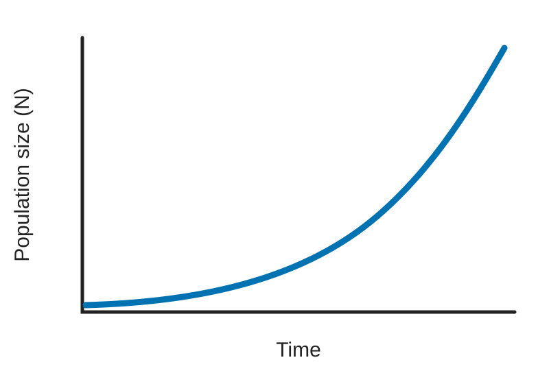
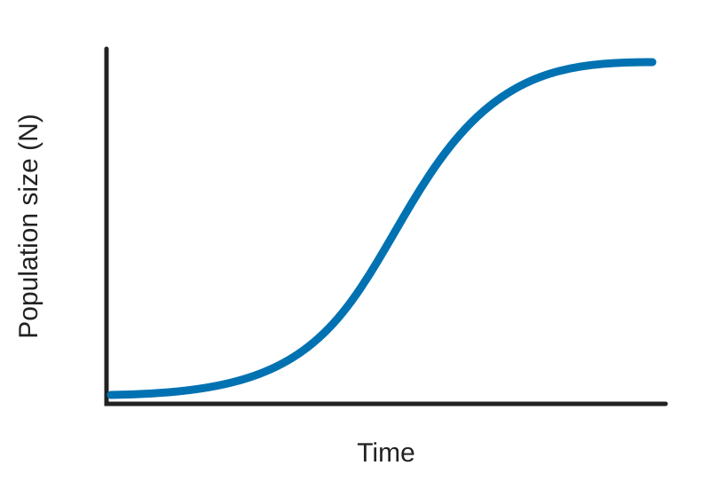
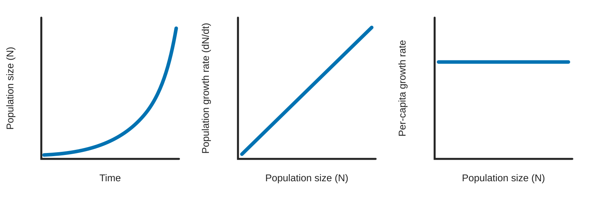
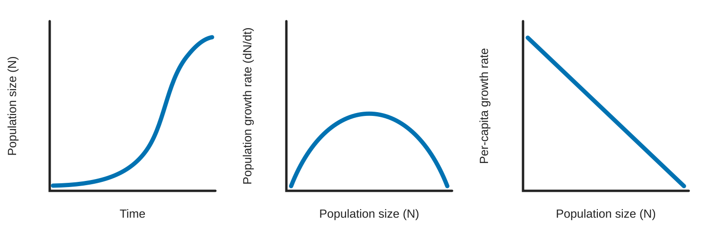
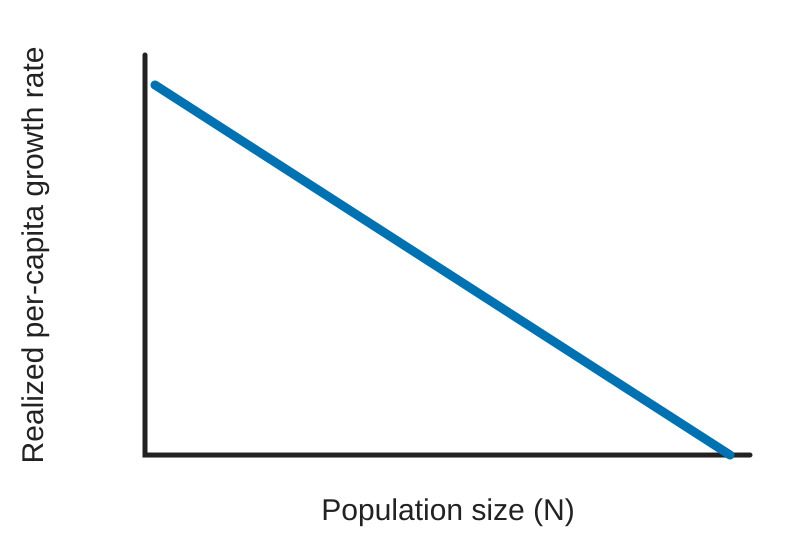

## Why does population growth sometimes accelerate—and sometimes slow down?

::::: columns
::: {.column width="49%"}
### Unlimited growth

{fig-alt="Population size increasing at an accelerating rate over time."}
:::

::: {.column width="49%"}
### Limited growth

{fig-alt="Population size initially increasing and then leveling off over time."}
:::
:::::

::: fragment
**What causes these different patterns?**
:::

## What does “growing faster” mean?

::::: columns
::: {.column width="49%"}
### Population growth rate

How many individuals are added to the **whole population** per unit time?

$$
\frac{\Delta N}{\Delta t}
\qquad \text{or} \qquad
\frac{dN}{dt}
$$

If a population grows from 100 to 120:

- population change = **+20**
- population growth rate = **20 per time period**
:::

::: {.column width="49%"}
### Per-capita growth rate

How much growth occurs **per existing individual**?

$$
\frac{1}{N}\frac{dN}{dt}
$$

For the same population:

$$
\frac{20}{100}=0.20
$$

Each individual contributes, on average, **0.20 additional individuals per time period**.
:::
:::::

::: fragment
A population can have a constant **per-capita growth rate** while its **population growth rate** increases.
:::

## Geometric and exponential growth

::::: columns
::: {.column width="42%"}
### What they share

Both models assume:

- a closed population
- resources do not limit growth
- per-capita growth remains constant

The main difference is **when reproduction occurs**.
:::

::: {.column width="56%"}
### Two measures of per-capita growth

|                  | $\lambda$               | $r$                        |
|------------------|-------------------------|----------------------------|
| **Name**         | Finite rate of increase | Intrinsic rate of increase |
| **Time**         | Discrete intervals      | Continuous                 |
| **Reproduction** | Synchronized            | Continuous                 |
| **No growth**    | $\lambda=1$             | $r=0$                      |
| **Conversion**   | $\lambda=e^r$           | $r=\ln(\lambda)$           |
:::
:::::

## Three ways to look at population growth

:::::: columns
::: {.column width="49%"}
### Population size

**How many individuals are there?**

$$N$$

Plot **population size vs. time**.

### Population growth rate

**How many individuals are being added?**

$$\frac{dN}{dt}$$

Plot **population growth rate vs.** $N$.
:::

:::: {.column width="49%"}
### Per-capita growth rate

**How much does each individual contribute to growth?**

$$
\frac{1}{N}\frac{dN}{dt}
$$

Plot **per-capita growth rate vs.** $N$.

::: callout-note
These three views describe the **same population**, but answer different questions.
:::
::::
::::::

## Constant per-capita growth ≠ constant population growth

:::::: columns
::: {.column width="49%"}
For exponential growth:

$$
\frac{dN}{dt}=rN
$$

If $r$ is constant:

- each individual makes the same average contribution
- the number of individuals keeps increasing

Therefore:

$$
N \uparrow \quad \Rightarrow \quad \frac{dN}{dt} \uparrow
$$
:::

:::: {.column width="49%"}
### Consider the aphid population

If $r$ remains constant, when are the **most aphids added per week**?

A. When the population is small\
B. When the population is intermediate\
C. When the population is largest\
D. The same number are added every week

::: fragment
**C. When the population is largest**

More aphids × same per-capita growth = more new aphids.
:::
::::
::::::

## Unlimited resources: what do we predict?

::::: columns
::: {.column width="65%"}
{fig-alt="Three graphs showing exponential growth predictions: population size accelerates over time, total population growth increases with population size, and per-capita growth remains constant."}
:::

::: {.column width="33%"}
### Population size

Accelerates over time: **J-shaped**

### Population growth rate

Increases with $N$:

$$\frac{dN}{dt}=rN$$

### Per-capita growth rate

Does **not** change with $N$:

$$\frac{1}{N}\frac{dN}{dt}=r$$
:::
:::::

## What happens when resources become limiting?

::::: columns
::: {.column width="49%"}
As population density increases:

1.  more individuals require resources
2.  resources per individual decline
3.  competition increases
4.  survival and/or reproduction decline

Therefore, **realized per-capita growth declines**.
:::

::: {.column width="49%"}
{fig-alt="Aphids feeding on a plant, illustrating increasing competition for a limited resource as aphid abundance increases."}

### Density dependence

The effect of a factor on population growth **depends on population density**.

Food, space, nesting sites, disease, and other factors can generate density dependence.
:::
:::::

## The logistic model accounts for resource limitation

::::: columns
::: {.column width="49%"}
Start with exponential growth:

$$
\frac{dN}{dt}=rN
$$

Add resource limitation:

$$
\frac{dN}{dt}=rN\left(1-\frac{N}{K}\right)
$$

$K$ is the **carrying capacity**.
:::

::: {.column width="49%"}
### What does the correction factor do?

$$
1-\frac{N}{K}
$$

| Population size |  Correction |
|-----------------|------------:|
| $N \ll K$       | $\approx 1$ |
| $N=K/2$         |       $0.5$ |
| $N=K$           |         $0$ |
| $N>K$           |    negative |

As $N$ approaches $K$, **realized per-capita growth approaches zero**.
:::
:::::

## Limited resources: what changes?

::::: columns
::: {.column width="65%"}
{fig-alt="Three graphs showing logistic growth predictions: population size approaches carrying capacity, total population growth peaks at half the carrying capacity, and realized per-capita growth declines with population size."}
:::

::: {.column width="33%"}
### Population size

Approaches $K$: **S-shaped**

### Population growth rate

Increases, then decreases; maximum at:

$$N=\frac{K}{2}$$

### Per-capita growth rate

Declines as $N$ increases; zero at $K$.
:::
:::::

## When does a population grow fastest?

::::: columns
::: {.column width="49%"}
### Per-capita growth

Highest when $N$ is **low**:

- abundant resources per individual
- little intraspecific competition

As $N$ increases, realized per-capita growth declines.

{fig-alt="Realized per-capita population growth declining linearly as population size increases, reaching zero at carrying capacity."}
:::

::: {.column width="49%"}
### Total population growth

Highest near:

$$
N=\frac{K}{2}
$$

Why not at low $N$?\
**Too few individuals.**

Why not near $K$?\
**Too little growth per individual.**

At $K/2$, the population balances **many individuals** with **relatively high per-capita growth**.
:::
:::::

## What causes population growth to slow?

::::: columns
::: {.column width="49%"}
### Density-dependent

The effect changes with population density.

- competition for food or space
- disease
- predation or parasitism

**Aphid example:** fungal disease

> Does the **proportion** of the population affected change with density?
:::

::: {.column width="49%"}
### Density-independent

The effect is relatively unrelated to population density.

- severe storms
- floods
- fires
- toxic spills

**Aphid example:** thunderstorm

The number affected may differ between large and small populations, so compare the **proportion affected**.
:::
:::::

## From assumptions to predictions

::::: columns
::: {.column width="49%"}
### Unlimited resources

**Geometric growth**

- discrete reproduction
- constant $\lambda$

**Exponential growth**

- continuous reproduction
- constant $r$

In both, per-capita growth remains constant as $N$ increases. Population growth therefore **accelerates**.
:::

::: {.column width="49%"}
### Limited resources

**Logistic growth**

As $N$ increases:

- resources per individual decline
- realized per-capita growth declines
- total population growth eventually slows
- $N$ approaches $K$

Population size therefore tends to **level off**.
:::
:::::

::: fragment
Population-growth models connect biological **assumptions** to testable **predictions**.
:::
