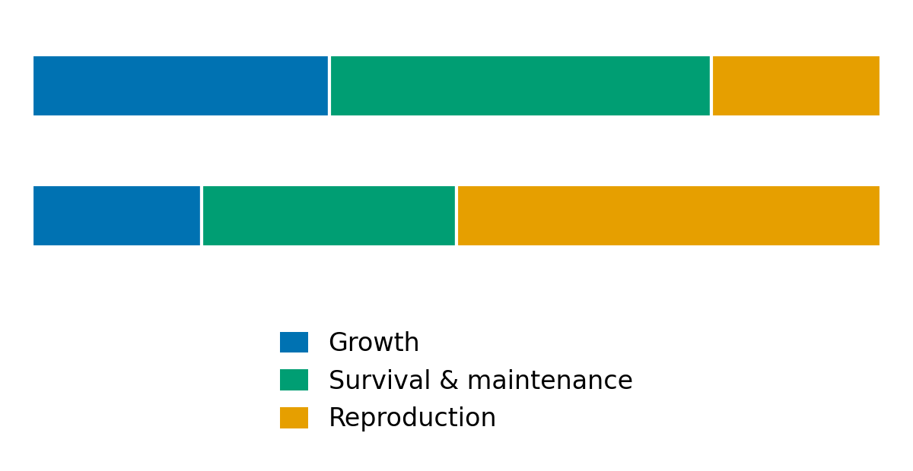

## Different ways to succeed

:::::: columns
::: {.column width="50%"}
- [Life history]{.keyword} describes the timing of growth, reproduction, and death.
- [Life-history traits]{.keyword} include when and how often organisms reproduce.
- Traits also include offspring number, parental investment, and lifespan.
- Natural selection favors different combinations under different conditions.
- **Why doesn’t every organism reproduce early, have many offspring, and live forever?**
:::

:::: {.column width="50%"}
::: {#fig-parental-care layout-ncol="1"}
{#fig-spider-young fig-alt="A female wolf spider with numerous tiny spiderlings clustered on her back." width="50%"}

.](https://upload.wikimedia.org/wikipedia/commons/1/1b/Capybara_mother_with_pups.jpg){#fig-capybara-young fig-alt="An adult capybara resting with four small pups gathered beside her." width="50%"}

Different patterns of offspring number and parental care.
:::
::::
::::::

::: notes
Start with the question, rather than reviewing every definition. Both organisms provide parental care, but differ in offspring number and investment. Remind students that a strategy is an evolved pattern, not a conscious plan.
:::

## Resources impose trade-offs

::::: columns
::: {.column width="50%"}
- Organisms have limited energy, resources, and time.
- The [Principle of Allocation]{.keyword}: resources used for one function cannot support another.
- A [trade-off]{.keyword} links a benefit in one trait to a cost in another.
- Greater investment in reproduction can reduce growth or future survival.
- [Fitness]{.keyword} reflects an organism’s contribution to future generations.
- **What might a parent sacrifice to raise more young?**
:::

::: {.column width="50%"}
{#fig-resource-allocation fig-alt="Two equal-length stacked bars represent the same total resource budget. The lower bar allocates more to reproduction and less to growth and survival than the upper bar."}
:::
:::::

::: notes
The percentages illustrate a hypothetical budget, not a universal allocation rule. At a fixed reproductive budget, producing more offspring also reduces resources per offspring. Connect this to energy budgets from physiological ecology.
:::

## Think–Pair–Share: Big bluestem

::::: columns
::: {.column width="60%"}
- **Plant height:** distance from the ground to the top of the plant.
- **Rame length:** length of one finger-like branch of the seed head.
- **Think — 1 minute:** How might greater height or longer rames improve survival or reproduction? What costs might each impose?
- **Pair — 2 minutes:** Compare ideas. Propose one benefit and one cost for each trait. When might a shorter plant or shorter rame be favored?
- **Share:** Explain one possible [trade-off]{.keyword}.
:::

::: {.column width="40%"}
.](https://upload.wikimedia.org/wikipedia/commons/b/ba/Andropogon_gerardii_%283904163898%29.jpg){fig-alt="Big bluestem flowering stem with narrow, finger-like seed-head branches called rames." height="450"}
:::
:::::

## Why delay reproduction?

::::: columns
::: {.column width="50%"}
- Earlier reproduction shortens [generation time]{.keyword} and can increase population growth.
- Delaying reproduction allows more time to grow.
- Larger sturgeon females have greater [fecundity]{.keyword}—they produce more eggs.
- Waiting pays off only if future reproductive benefits outweigh the costs and risk of dying first.
- **How might increased mortality of older fish change which strategy is favored?**
:::

::: {.column width="50%"}
{fig-alt="A scatterplot shows a strong positive relationship between sturgeon body mass and fecundity measured in thousands of eggs."}

[Bruch et al. (2006)]{.small}
:::
:::::

::: notes
Connect to the Simploid activity: early reproduction wins when everything else is equal. Real organisms face additional costs and benefits. In the chapter's SimSturgeon model, increased mortality of older fish reduces the benefit of waiting. Distinguish a model prediction about selection from an immediate evolutionary change in real fish.
:::

## Populations contain different ages

::::: columns
::: {.column width="50%"}
- [Age structure]{.keyword} describes the distribution of individuals among age classes.
- An [age pyramid]{.keyword} displays that distribution.
- Survival and reproduction vary with age.
- Populations of the same size can grow differently if their age structures differ.
- **Would having many young individuals guarantee population growth? Why or why not?**
:::

::: {.column width="50%"}
{fig-alt="A broad-based age pyramid shows many young individuals and fewer individuals in older age classes, with males and females on opposite sides."}
:::
:::::

::: notes
key discussion point: young individuals must survive to reproductive age. A broad base alone does not guarantee growth.
:::

## Survivorship follows a cohort

::::: columns
::: {.column width="50%"}
- A [cohort]{.keyword} is a group of individuals born during the same period.
- [Survivorship]{.keyword}, $l_x$, is the fraction of the original cohort still alive at age $x$.
- A [survivorship curve]{.keyword} plots the number or fraction surviving against age.
- An age pyramid shows a population snapshot; a survivorship curve describes survival as a cohort ages.
- **At which ages is mortality greatest?**
:::

::: {.column width="50%"}
{fig-alt="Three idealized survivorship curves show late mortality in Type I, constant proportional mortality in Type II, and high early mortality in Type III; survivor number is shown on a logarithmic scale."}
:::
:::::

::: notes
For example, if 200 of an original 1000 individuals remain, survivorship is 0.2. This is cumulative survival from birth, not the probability of surviving just the next year. Explain that equal vertical distances on a logarithmic axis represent equal ratios, not equal numbers of deaths.
:::

## Three patterns of mortality

::::: columns
::: {.column width="50%"}
- **Type I:** Low mortality early in life; high mortality in old age. Example: humans.
- **Type II:** A constant proportion dies in each time interval. Example: some birds.
- **Type III:** High early mortality; lower mortality among survivors. Example: barnacles.
- These are idealized patterns. Real populations may combine them.
- **Why does Type II form a straight line on a logarithmic axis?**
:::

::: {.column width="50%"}
{fig-alt="Type I remains high until late life, Type II declines as a straight line on the logarithmic axis, and Type III drops sharply early before flattening."}
:::
:::::

::: notes
- Type II means the same proportion dies in each equal interval, not the same number.

  - For example, 10 percent mortality leaves 900, then 810, then 729 of an original 1000.

  - A logarithmic axis makes constant proportional decline appear straight.

- Type III does not mean everyone who survives infancy lives to maximum lifespan. Avoid treating the curve types as rigid species categories.
:::

## Life tables combine survival and reproduction

::::: columns
::: {.column width="50%"}
- A [life table]{.keyword} summarizes survival and reproduction by age.
- $n_x$: number alive at the start of age class $x$.
- $l_x=n_x/n_0$: fraction of the original cohort still alive.
- $m_x$: [age-specific fecundity]{.keyword}—average daughters produced per surviving female during that age class.
- $l_xm_x$: expected daughters produced at that age per original cohort member.
- **Why must we multiply fecundity by survivorship?**
:::

::: {.column width="50%"}
{fig-alt="A Columbian ground squirrel life table reports age-specific survivors, survivorship, fecundity, and reproductive contributions. Its net reproductive rate is 1.02 and generation time is 2.17 years."}
:::
:::::

::: notes
Walk through one row conceptually. Survival and reproduction must be combined: high fecundity at an age few individuals reach contributes relatively little. Female-only accounting is the chapter's simplification, not a claim that males are unimportant.

The answer: reproductive output at an age contributes only if individuals survive to reach it.
:::

## How many offspring—and how soon?

::::: columns
::: {.column width="50%"}
- [Net reproductive rate]{.keyword}, $R_0=\sum l_xm_x$, estimates lifetime daughters per newborn female.
- $R_0>1$: above replacement; $R_0=1$: replacement; $R_0<1$: below replacement.
- [Generation time]{.keyword}, $G$, is the average age at which females produce daughters, weighted by survival and fecundity.
- For the same $R_0>1$, shorter generations mean faster population growth.
- Growth rate can be approximated as $r\approx\ln(R_0)/G$.
- **Both bird populations have the same** $R_0$. Which grows faster—and why?
:::

::: {.column width="50%"}
{fig-alt="Blue and brown birds both have net reproductive rate 1.1. Blue birds reproduce at age one, while brown birds reproduce at age two, doubling generation time."}
:::
:::::

::: notes
Use G to match the supplied chapter, rather than T from the older faculty learning objectives. Both birds have R0 = 1.1, but blue birds have G = 1 year and brown birds G = 2 years. Their approximate r values are 0.095 and 0.048 per year. R0 = 1 represents replacement. These projections assume the represented survival and fecundity schedules continue; actual populations can show temporary changes from age structure or migration. The formula is an approximation, not an exact solution for every life table.
:::

## Life history informs conservation

::::: columns
::: {.column width="50%"}
- Chimpanzees hunt red colobus monkeys, especially young individuals.
- These life tables assume equal fecundity but different [survivorship]{.keyword}.
- Estimated $R_0$: **0.52 in hunted populations; 1.17 in nonhunted populations.**
- Lower survival can prevent a population from replacing itself.
- **Could immigration sustain the hunted population? What conservation action might help?**
:::

::: {.column width="50%"}
{fig-alt="Hunted and nonhunted red colobus life tables use identical age-specific fecundity but different survivorship. Net reproductive rate is 0.52 in the hunted population and 1.17 in the nonhunted population."}

[SimUText summary of Fourrier et al.]{.small}
:::
:::::

::: notes
- Both life tables assume equal fecundity. Lower survivorship explains the hunted population’s lower $R_0$.
- Chimpanzees primarily kill young monkeys. Those individuals lose all opportunities for future reproduction.
- $R_0=0.52$ means below replacement; $R_0=1.17$ means above replacement. These are lifetime measures, not annual growth rates.
- **Yes, immigration could sustain the hunted population** if arrivals compensate for losses. This is a potential source–sink relationship.
- Restoring forest connections could support immigration. Nearby source populations would also need protection.
- Immigration can support persistence without making local reproduction self-sustaining.
- The chapter also explores increased fecundity after infant loss, which may partly compensate for predation.
- Life tables help identify why populations decline and which conservation actions might help.
:::
